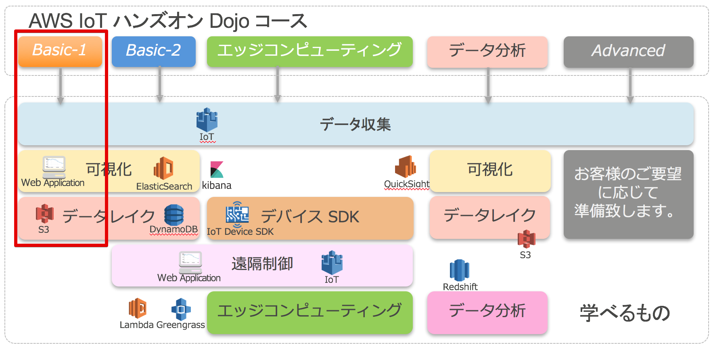
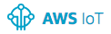

=======================
イントロダクション
=======================

WS IoT ハンズオン Dojo コース
============================================

今回のAWS IoT ハンズオン Dojo コースは、市販のIoTゲートウエイデバイスを使用してAWS IoTに接続し、データの保存、可視化を行う Basic-2 コースです。

|

ハンズオンシナリオ
====================

BLEゲートウェイをAWS IoTに登録し、AWS IoTへの接続の設定を行い、温度、湿度の収集を行います。

シナリオ１では、収集されたデータを活用しやすい形式に変換し、クラウド保存スペースに保存します。

シナリオ２では、データ変換を行い、Webアプリケーションでグラフ化し、モニターします。

シナリオ2+は、Elastic Search Service + Kibanaで可視化を行います。(オプションシナリオです。)

.. image:: images/01/overview.png

|

利用するデバイス、アプリケーション、サービス
========================================================

レンジャーシステムズ BLE Gateway (iBS01W)
-----------------------------------------------

レンジャーシステムズ社が提供するBLE/WiFiゲートウェイです。本ハンズオンでは、センサーからBLE(Bluetooth Low Energy)経由で温度/湿度データ収集し、AWS IoTへの温度/湿度データの送信に利用します。レンジャーシステムズ社のゲートウェイは、AWS IoTに直接接続可能で、AWSとの親和性が非常に高い製品です。他にLTE版のゲートウエイもあります。
    http://www.ranger-systems.co.jp/iot/

|

レンジャーシステムズ 温湿度センサー (iBS01T)
-----------------------------------------------

レンジャーシステムズ社が提供するBLE Beacon温湿度センサーです。ボタン電池で動作し、電池寿命は1.4年で、長時間使用できます。

AWSアカウント
-----------------------------------------------

センサーデータの保存先として使用するAWSを利用・管理するためのアカウント。アカウント作成の手順はこちらの通りです。
    https://aws.amazon.com/jp/register-flow/

|

AWS IoT
-----------------------------------------------

接続されたデバイスが安全かつ簡単にクラウドアプリケーションやその他のデバイスとやりとりするためのマネージド型プラットフォームです。本ハンズオンでは、デバイスからのセンサーデータの受信で利用します。
    https://aws.amazon.com/jp/iot/

|

Amazon Kinesis Firehose
-----------------------------------------------

Amazon Kinesis Firehose は、ストリーミングデータを AWS にロードする最も簡単な方法です。本ハンズオンでは、AWS IoTで取得したBLE Beaconデータを加工すし、S3に保存したり、ElasticSearch Serviceに保存し可視化するために使用します。
    https://aws.amazon.com/jp/kinesis/firehose/

|

Amazon Elasticsearch Service
-----------------------------------------------

オープンソースのElasticsearchを利用できるマネージド型のサービスです。本ハンズオンでは、データのストアとElasticsearchで利用できるKibanaを利用してデータの可視化に利用します。
    https://aws.amazon.com/jp/elasticsearch-service/

|

Amazon S3 (Simple Storage Service)
-----------------------------------------------

スケーラブルなクラウドストレージです。Webのコンテンツを配置してWebサーバとしても利用できます。本ハンズオンでは、センサーから取得したデータの保存先として使用します。
    https://aws.amazon.com/jp/sns/

|

AWS Lambda
-----------------------------------------------

お客様のコードをイベント発生時やリクエストごとに実行できる管理不要なコンピューティングプラットフォームです。本ハンズオンでは、Amazon Kinesis Firehose内でセンサーデータの加工に使用します。
    https://aws.amazon.com/jp/lambda/

|

Amazon CloudWatch
-----------------------------------------------

AWSクラウドリソースとAWSで実行するアプリケーションのモニタリングサービスです。メトリクスの収集、ログファイルの収集が可能です。本ハンズオンではCloudWatch Logsを利用してAWS IoTのログを収集、閲覧します。
    https://aws.amazon.com/jp/cloudwatch/

|
