=================
AWS IoT基本設定
=================

この章では、AWS IoTにIoTデバイスであるBLEゲートウェイを登録し、認証、認可の設定を行います。
AWS IoTのコンソール画面で、IoTデバイスを作成します。証明書を作成し、アクセス権(ポリシー) を付与し、登録したデバイスに関連付ける設定を行います。作成した証明書は後ほどBLEゲートウェイにインストールします。これにより、BLEゲートウェイがAWS IoTに安全に接続し、暗号化通信によるセキュアなデータ通信が可能になります。

AWS マネジメントコンソールにサインイン
=======================================

まずは、下記のURLにアクセスして、アカウントID、ユーザー名、パスワードを入力しAWSマネージメントコンソールにサインインして下さい。ルートアカウントでログインする場合は、「ルートアカウント認証情報を使用してサインイン」をクリックして下さい。

複数の参加者で1つのAWSアカウントを共用している場合、ルートユーザーにAWSマネジメントコンソールにログインするURLを教えてもらってください。通常、下記の様なURLになっています。

https://<12桁のAWS ID>.signin.aws.amazon.com/console

============= ============================
項目              値
============= ============================
アカウント	        AWSのアカウントID (12桁の数字)
ユーザー名         IAMユーザー名
パスワード         IAMユーザー パスワード
============= ============================

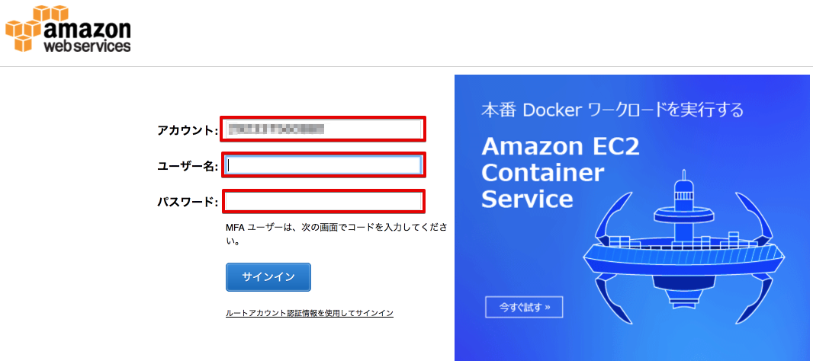

|

デバイスの作成
=======================

AWS IoTで使用するIoTデバイスを登録します。

AWSマネージメントコンソールを開き、右上のリージョン一覧から
[米国東部(バージニア北部)]を選択します。

.. image:: images/02/regions-us@2x.png

|

サービス一覧から[AWS IoT]をクリックして開きます。

.. image:: images/02/iot-servicemenu@2x.png

|

AWS IoTのダッシュボードが表示されます。

.. image:: images/02/iot-dashboard@2x.png

|

下記の画面が表示された場合は、[Get started]をクリックします。

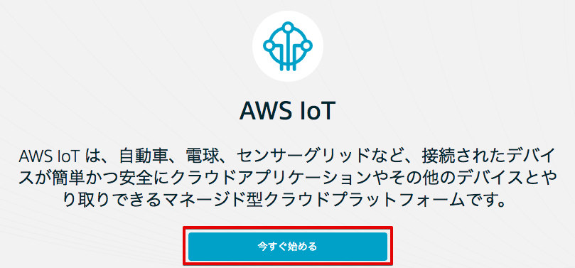

|

デバイス(Thing)を作成します。メニューから[Registry]-[Things]をクリックします。以下の様な画面が表示された場合は、[Registry a thing]をクリックします。

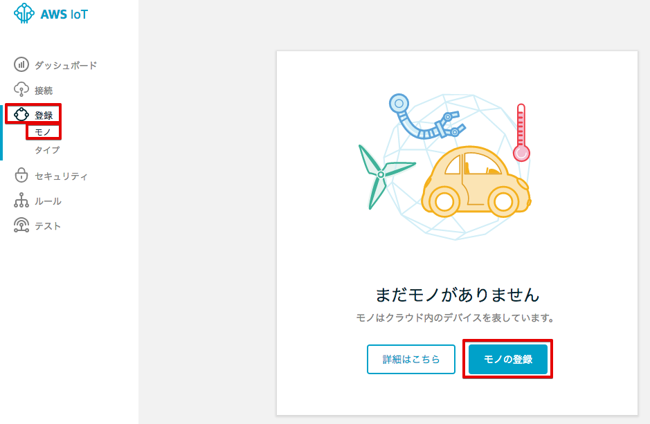

|

あるいは、デバイス(Thing)一覧が表示された場合は、[Create]をクリックします。

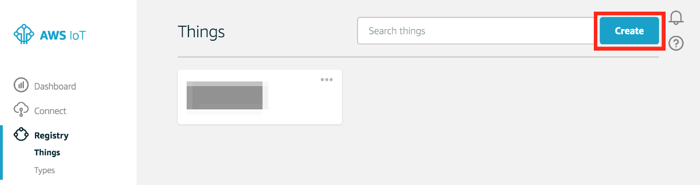

|

[Name]に”ranger-gw-<参加者番号>”と入力し、[Create thing]をクリックします。

============= ============================
項目            値
============= ============================
Name	          ranger-gw-<参加者番号>
============= ============================

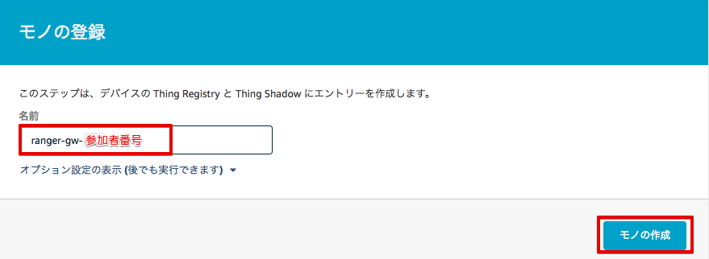

|

[←]をクリックして下さい。

デバイス(Thing)一覧が表示され、作成したデバイスが表示されている事を確認します。

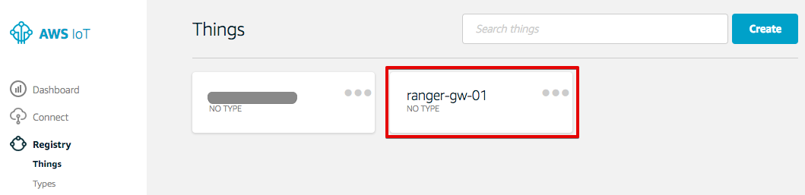

|

メニューから[Settings]をクリックします。以下の様な画面が表示されます。
EndpointのURLが表示されます。このEndpointは、ゲートウェイがデータを送信する宛先になります。
Endpointは、AWS アカウント固有のURLです。複数の参加者で1つのAWSアカウントを共用する場合は、IAMユーザー間では共通になります。

このEndpoint情報は、後ほどゲートウェイの設定のところで参照しますので、ノートパッドなどに記録しておいて下さい。

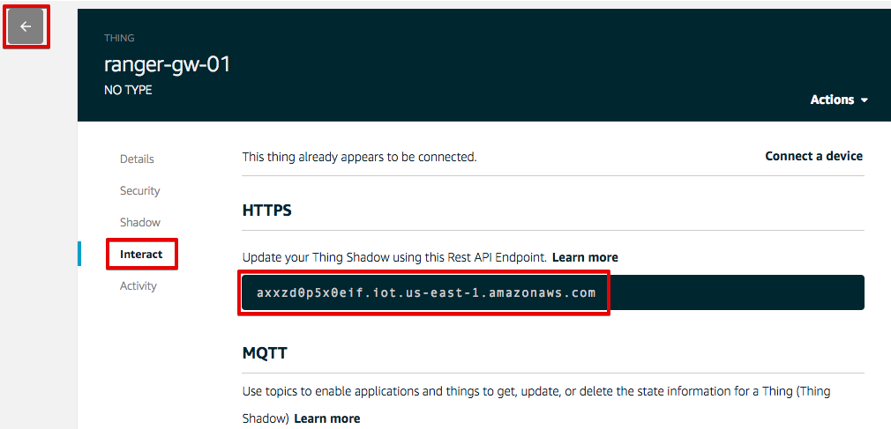

|

ポリシーの作成
===========================

デバイスに対して、AWS IoTの各種操作を許可するためのポリシーを作成します。

メニューから[Security]-[Policies]をクリックします。以下の様な画面が表示された場合は、[Create a policy] をクリックします。

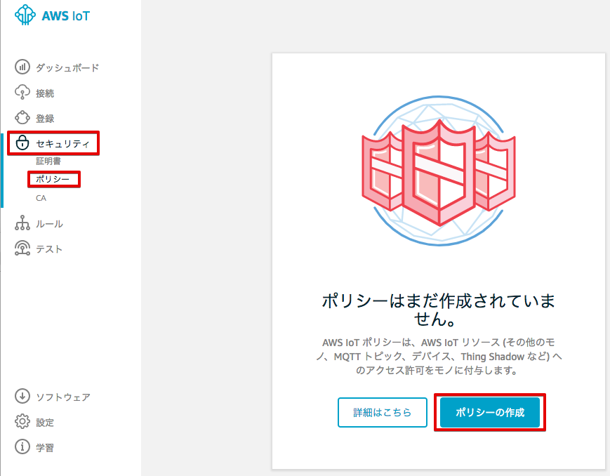

|

あるいは、ポリシー一覧が表示された場合は、[Create]をクリックします。

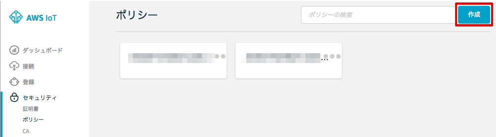

|

フォームにそれぞれ以下のパラメータを入力し、[Create] をクリックします。

============= ============================
項目            値
============= ============================
Name	          awsiot-handson-policy-<参加者番号>
Action	        iot:\*
  Resource ARN	  \*
Effect	        Allow (チェックを入れて下さい)
============= ============================

「*」は、半角の＊(アスタリスク)です。

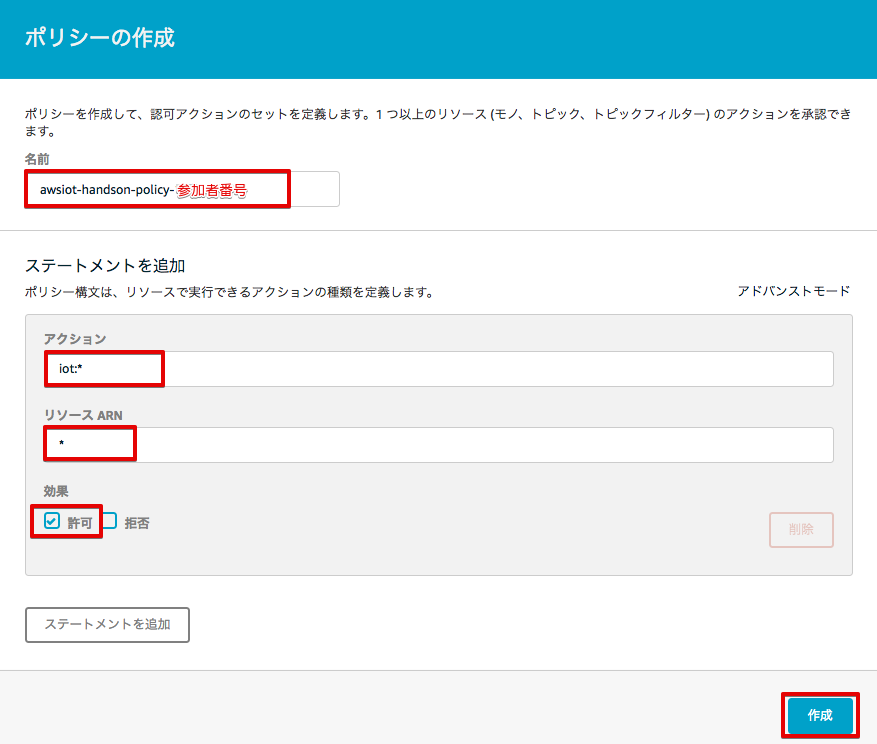

|

[←]をクリックして下さい。

ポリシーの一覧が表示され、作成したポリシーが表示されている事を確認します。

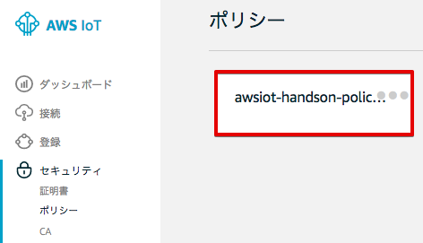

|

ここで作成するポリシーは、AWS IoTへの全てのアクセス権限(AWS IoTへの接続、データの送受信、デバイスシャドウの操作) を持っています。実運用では、セキュリティー向上のために、デバイスに必要とされる権限だけを付与することを勧めします。

ここで作成したポリシーは、次のステップで作成する証明書と関連付けされます。最終的にデバイスと関連付けされ、デバイスのアクセス権限を規定することになります。

証明書の作成
=======================

AWS IoTで使用するX.509証明書を作成します。デバイスはこの証明書を使用してAWS IoTとの間で相互に認証を行いAWS IoTに接続し、暗号化通信を行います。この証明書は、後にBELゲートウェイにインストールします。

メニューから[Security]-[Cetificate]をクリックします。以下の様な画面が表示された場合は、[Create a crtificate]をクリックします。

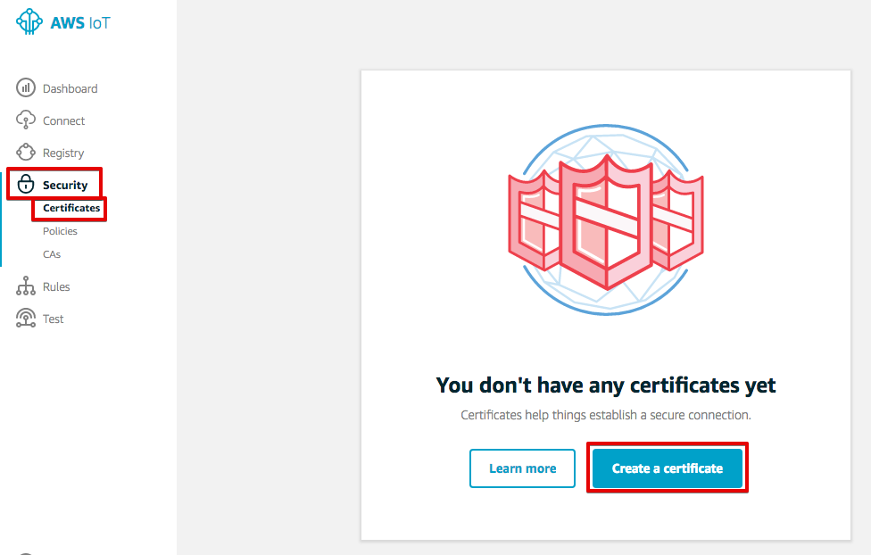

|

以下の様な画面が表示された場合は、[One-click certificate creation]右の[Create certificate]をクリックします。

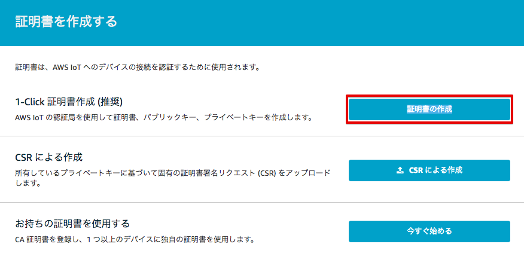

|

下記の様に、"Certificate created!"と表示されたら、証明書(Certificate)とプライベートキー(Private key)をPCにダウンロードして下さい。各ファイルのサイズは、証明書が1,220バイト程度、プライベートキーが1,670バイト程度になります。

これらは、後ほど、BLEゲートウェイにインストールします。証明書の番号は、後ほど証明書の割当てのところで参照しますので、ノートパッドなどに記録しておいて下さい。
証明書の番号とは、ファイル名が "xxxxxxxxxx-certificate.pem.crt" の場合、冒頭の "xxxxxxxxxx" になります。

証明書とプライベートキーのダウンロードが終わったら、[Activate] をクリックして証明書を有効にして下さい。

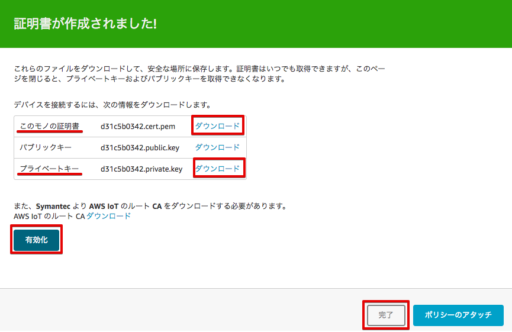

|

最後に、左上の[←]を２回押して、戻って下さい。先ほど作成した証明書が表示され、"**ACTIVATE**" (有効) 状態になっている確認して下さい。証明書が有効になっていない場合、その証明書を使っているデバイスは、AWS IoTに接続出来なくなります。

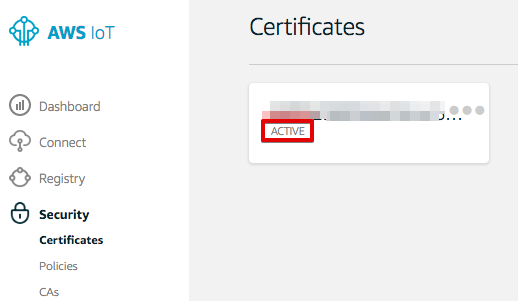

|

今回は、AWS IoTによって証明書を作成しますが、お客様が作成した証明書を使用する事も出来ます。その際、証明書を作成するために使用したCA証明書と作成した証明書をAWS IoTに登録する必要があります。

実運用時、１つの証明書を全てのデバイスで共用する事も可能ですが、ポリシー管理や証明書が失効した場合などにきめ細かく管理するために、各デバイスで異なる証明書を使用するすることをお勧めします。何かしらのセキュリティー問題が発生した場合、該当するデバイスの証明書を無効にするだけで、デバイスはAWS IoTへの接続ができなくなります。

デバイス、ポリシーを証明書に割当てる
===========================================

作成したデバイス、ポリシーを証明書に割当てます。

メニューから[Security]-[Certificates]をクリックします。証明書一覧から「証明書の作成」のセクションで保存した証明書のIDに一致する証明書をクリックして開きます。

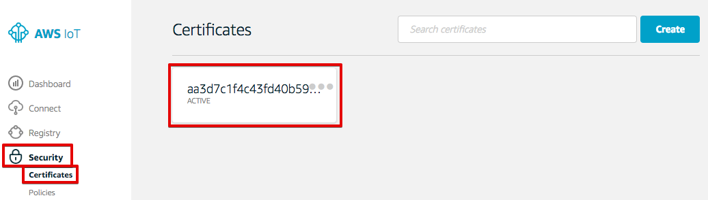

|

証明書の詳細が表示されます。[Actions] - [Attach policy]を選択します。

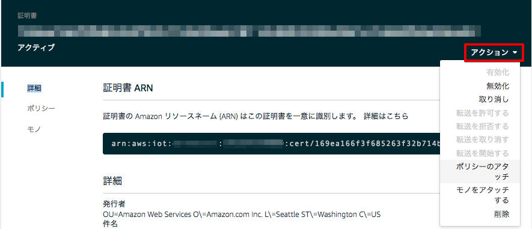

|

”awsiot-handson-policy-<参加者番号>”を選択し、[Attach] をクリックします。

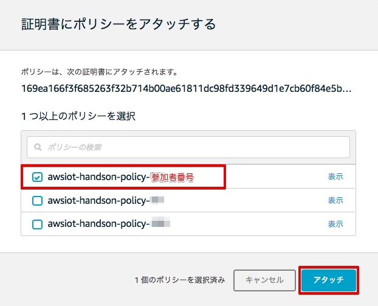

|

[Actions] - [Attach thing]を選択します。

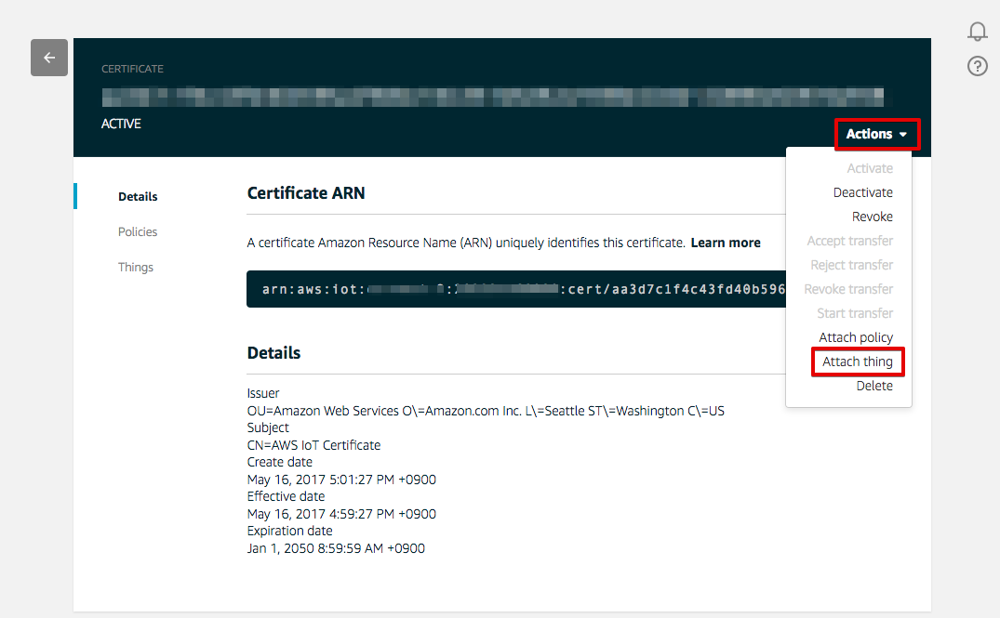

|

“ranger-gw-<参加者番号>”を入力し、[Attach] をクリックします。

.. image:: images/02/attach-thing-2.png

|

これで、AWS IoTの基本設定は、終わりです。次に、BLEゲートウェイがAWS IoTに接続するための設定を行います。
