=================
AWS IoT基本設定
=================

このセクションでは、AWS IoTにIoTデバイスであるBLEゲートウェイを登録し、認証、認可の設定を行います。
AWS IoTのコンソール画面で、IoTデバイスを作成します。証明書を作成し、アクセス権(ポリシー) を付与し、登録したデバイスに関連付ける設定を行います。作成した証明書は後ほどBLEゲートウェイにインストールします。これにより、BLEゲートウェイがAWS IoTに安全に接続し、暗号化通信によるセキュアなデータ通信が可能になります。

AWS マネジメントコンソールにサインイン
=======================================

まずは、WiFiに接続して、AWS マネジメントコンソールにサインインして下さい。

IAMユーザーではなく、ルートアカウントを使用する場合
^^^^^^^^^^^^^^^^^^^^^^^^^^^^^^^^^^^^^^^^^^^^^^^^^^^^^^^^^^^^^^^^^^^

ルートアカウントでログインする場合は、下記のURLからAWSにサインインして下さい。

https://console.aws.amazon.com/console/home

複数の参加者で1つのAWSアカウントを共用する場合
^^^^^^^^^^^^^^^^^^^^^^^^^^^^^^^^^^^^^^^^^^^^^^^^^^^^^^^^^^^^^^^^^^^

下記のURLにアクセスし、アカウントID、ユーザー名、パスワードを入力し、AWSマネージメントコンソールにサインインして下さい。

複数の参加者で1つのAWSアカウントを共用している場合、ルートユーザーにAWSマネジメントコンソールにログインするURLを教えてもらってください。通常、下記の様なURLになっています。

https://<12桁のAWS ID>.signin.aws.amazon.com/console

============= ============================
項目              値
============= ============================
アカウント	        AWSのアカウントID (12桁の数字)
ユーザー名         IAMユーザー名
パスワード         IAMユーザー パスワード
============= ============================

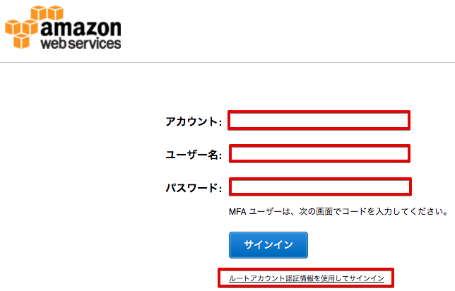

|

デバイスの作成
=======================

AWS IoTで使用するIoTデバイスを登録します。

AWSマネージメントコンソールを開き、右上のリージョン一覧から
[米国東部(バージニア北部)]を選択します。

.. image:: images/02/regions-us@2x.png

|

サービス一覧から[AWS IoT]をクリックして開きます。

.. image:: images/02/iot-servicemenu@2x.png

|

AWS IoTのダッシュボードが表示されます。

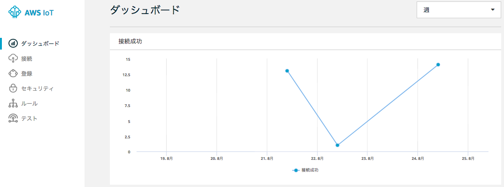

|

下記の画面が表示された場合は、[今すぐ始める] をクリックします。

.. image:: images/02/iot-get-started.png

|

デバイス(Thing)を作成します。メニューから [登録]-[モノ] をクリックします。以下の様な画面が表示された場合は、[モノの登録] をクリックします。

|

あるいは、デバイス(Thing)一覧が表示された場合は、[作成] をクリックします。

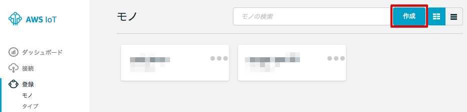

|

[名前] に ”ranger-gw-<参加者番号>” と入力し、[モノの作成] をクリックします。

============= ============================
項目            値
============= ============================
Name	          ranger-gw-<参加者番号>
============= ============================

|

[←]をクリックして下さい。

デバイス(Thing)一覧が表示され、作成したデバイスが表示されている事を確認します。

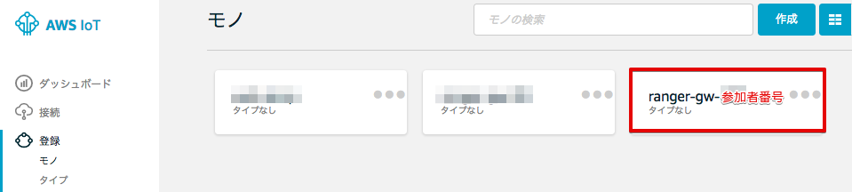

|

Endpointを記録する
^^^^^^^^^^^^^^^^^^^^^^^^^^^^^^

Endpointは、ゲートウェイがデータを送信する宛先になります。AWS アカウント固有のURLです。複数の参加者で1つのAWSアカウントを共用する場合は、Endpointは、IAMユーザー間では共通になります。

メニューから [設定] をクリックします。以下の様な画面が表示されます。
エンドポイント のURLが表示されます。このEndpoint情報は、後ほどゲートウェイの設定などで使用しますので、必ず、ノートパッドなどに記録しておいて下さい。

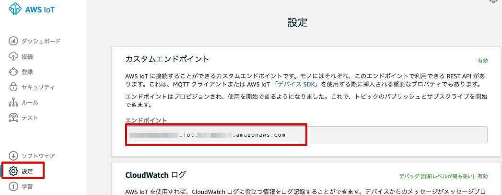

|

ポリシーの作成
===========================

デバイスに対して、AWS IoTの各種操作を許可するためのポリシーを作成します。

メニューから [セキュリティ]-[ポリシー] をクリックします。以下の様な画面が表示された場合は、[ポリシーの作成] をクリックします。

|

あるいは、ポリシー一覧が表示された場合は、[作成] をクリックします。

|

フォームにそれぞれ以下のパラメータを入力し、[作成] をクリックします。

============= ============================
項目              値
============= ============================
名前	            awsiot-handson-policy-<参加者番号>
アクション	        iot:\*
リソース ARN	     \*
効果	            許可 (チェックを入れて下さい)
============= ============================

「*」は、半角の＊(アスタリスク)です。

|

[←]をクリックして下さい。

ポリシーの一覧が表示され、作成したポリシーが表示されている事を確認します。

|

ここで作成するポリシーは、AWS IoTへの全てのアクセス権限(AWS IoTへの接続、データの送受信、デバイスシャドウの操作) を持っています。実運用では、セキュリティー向上のために、デバイスに必要とされる権限だけを付与することを勧めします。

ここで作成したポリシーは、次のステップで作成する証明書と関連付けされます。最終的にデバイスと関連付けされ、デバイスのアクセス権限を規定することになります。

証明書の作成
=======================

AWS IoTで使用するX.509証明書を作成します。デバイスはこの証明書を使用してAWS IoTとの間で相互に認証を行いAWS IoTに接続し、暗号化通信を行います。この証明書は、後にBELゲートウェイにインストールします。

メニューから [セキュリティ]-[証明書] をクリックします。以下の様な画面が表示された場合は、[証明書を作成する] をクリックします。

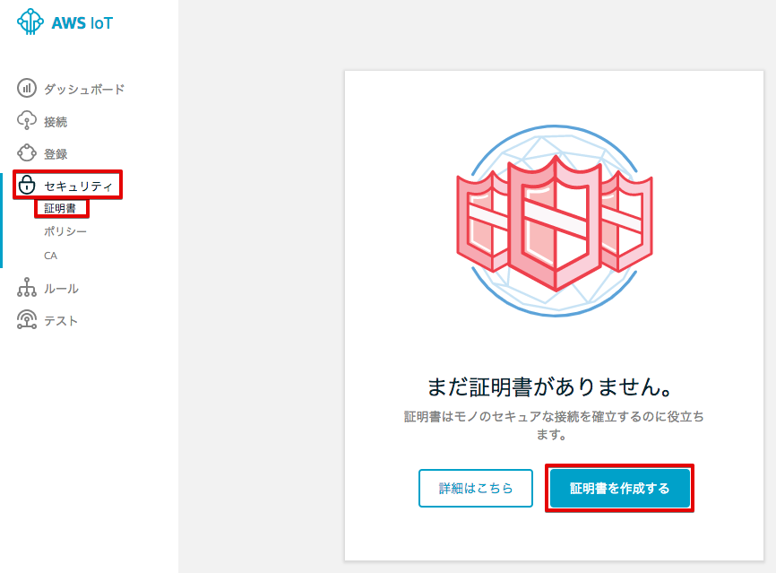

|

あるいは、証明書一覧が表示された場合は、[作成] をクリックします。

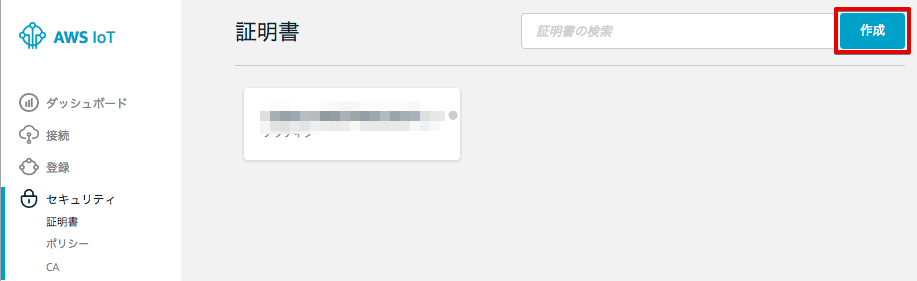

|

「証明書を作成する」画面が表示されますので、[1-Click 証明書作成 (推奨)] 右の [証明書の作成] をクリックします。

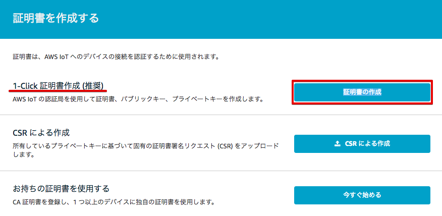

|

下記の様に、"証明書が作成されました!" と表示されたら、「このモノの証明書」と 「プライベートキー」をPCにダウンロードして下さい。各ファイルのサイズは、証明書が1,220バイト程度、プライベートキーが1,670バイト程度になります。

これらファイルは、後ほど、BLEゲートウェイにインストールします。証明書の番号は、後ほど証明書の割当てのところで参照しますので、ノートパッドなどに記録しておいて下さい。
証明書の番号とは、ファイル名が "xxxxxxxxxx-certificate.pem.crt" の場合、冒頭の "xxxxxxxxxx" になります。

証明書とプライベートキーのダウンロードが終わったら、[有効化] をクリックして証明書を有効にして下さい。その後、[完了] をクリックして下さい。

|

先ほど作成した証明書が表示されます。"**アクティブ**" 状態になっている確認して下さい。証明書が有効になっていない場合、その証明書を使っているデバイスは、AWS IoTに接続出来ません。

.. image:: images/02/confirm-certificate.png

|

今回は、AWS IoTによって証明書を作成しますが、お客様が作成した証明書を使用する事も出来ます。その際、証明書を作成するために使用したCA証明書と作成した証明書をAWS IoTに登録する必要があります。

実運用時、１つの証明書を全てのデバイスで共用する事も可能ですが、ポリシー管理や証明書が失効した場合などにきめ細かく管理するために、各デバイスで異なる証明書を使用するすることをお勧めします。何かしらのセキュリティー問題が発生した場合、該当するデバイスの証明書を無効にするだけで、そのデバイスはAWS IoTへの接続ができなくなります。

デバイス、ポリシーを証明書に割当てる
===========================================

作成したデバイス、ポリシーを証明書に割当てます。

メニューから [セキュリティ]-[証明書] をクリックします。証明書一覧から「証明書の作成」のセクションで保存した証明書の番号に一致する証明書をクリックして開きます。

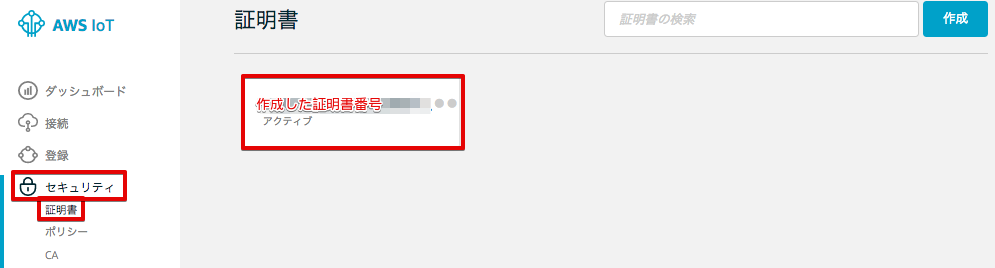

|

証明書の詳細が表示されます。[アクション]-[ポリシーのアタッチ] を選択します。

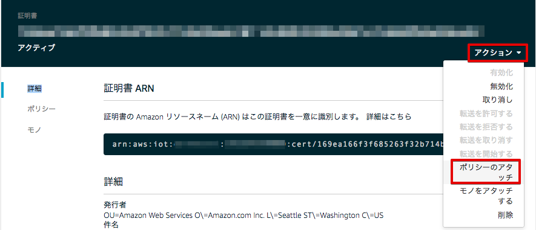

|

”awsiot-handson-policy-<参加者番号>” を選択し、[アタッチ] をクリックします。

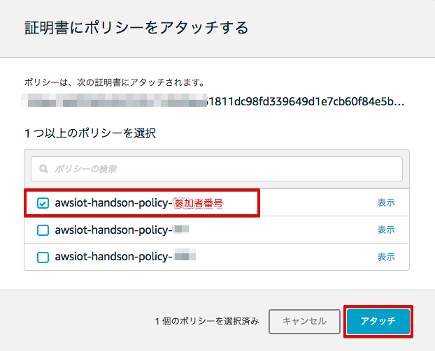

|

[アクション]-[モノをアタッチする]を選択します。

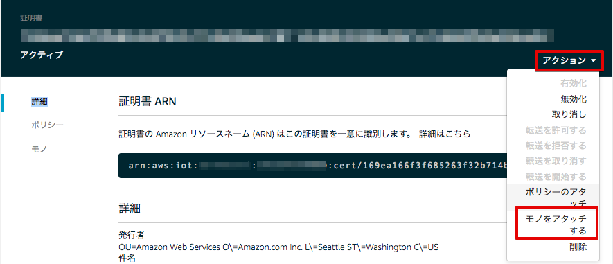

|

“ranger-gw-<参加者番号>” を選択し、[アタッチ] をクリックします。

.. image:: images/02/attach-thing-2.png

|

これで、AWS IoTの基本設定は、終わりです。デバイス、証明書、ポリシーの関連付けが終わりました。次のセクションでは、BLEゲートウェイがAWS IoTに接続するための設定を行います。
