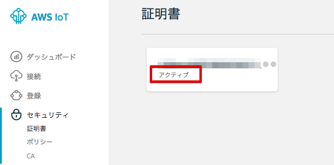

================
 AWS環境の準備
================

AWS IoT用の証明書を作成
====================

AWSマネージメントコンソールを開き、右上のリージョン一覧から[米国東部（バージニア北部）]を選択します。

.. image:: images/02/regions-us@2x.png

|

サービス一覧から[AWS IoT]をクリックして開きます。

.. image:: images/02/iot-servicemenu@2x.png

|

AWS IoTのダッシュボードが表示されます。

.. image:: images/02/iot-dashboard@2x.png

|

下記の画面が表示された場合は、[Get started]をクリックします。

.. image:: images/02/iot-get-started.png

|

証明書を作成します。メニューから[Security]-[Cetificate]をクリックします。以下の様な画面が表示された場合は、[Create a ertificate]をクリックします。

.. image:: images/02/crreate-certificate.png

|

以下の様な画面が表示された場合は、[One-click certificate creation]右の[reate certificate]をクリックします。

.. image:: images/02/crreate-certificate-2.png

|

下記の様に、"Certificate created!"と表示されたら、証明書(Certificate)とプライベートキー(Private key)をダウンロードします。これらは、後ほど、BLEゲートウェイにアップロードします。最後に[Activate]をクリックして証明書を有効にして下さい。

.. image:: images/02/certificate-created.png

|

最後に、左上の[←]を２回押して、戻って下さい。先ほど作成した証明書が 表示され、"**ACTIVATE**"状態になっている確認して下さい。

|

これで、証明書の作成は終了です。
