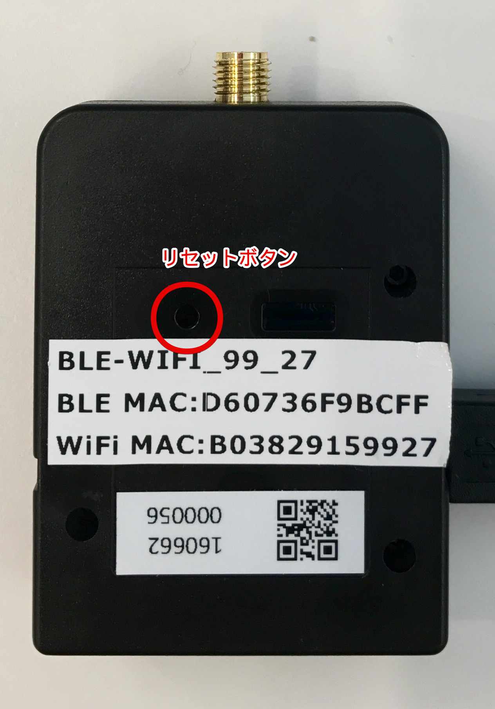
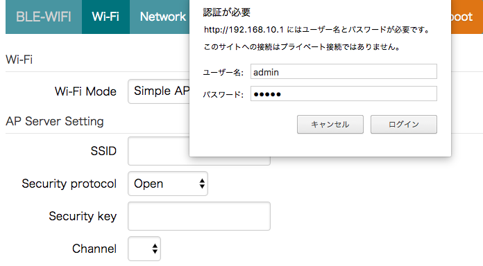
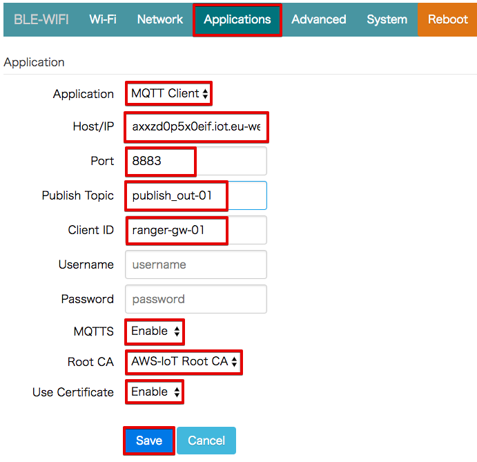
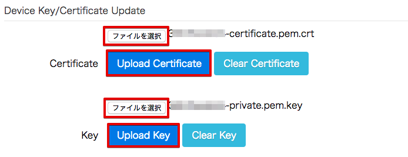
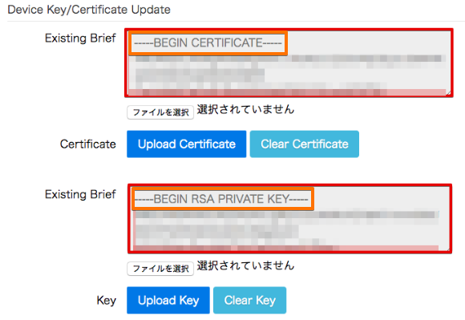
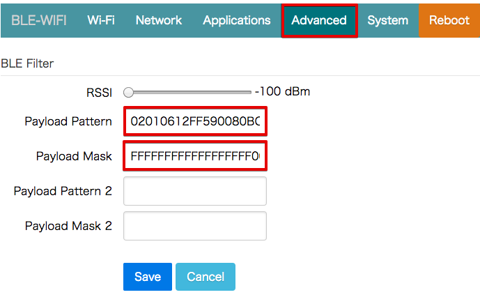
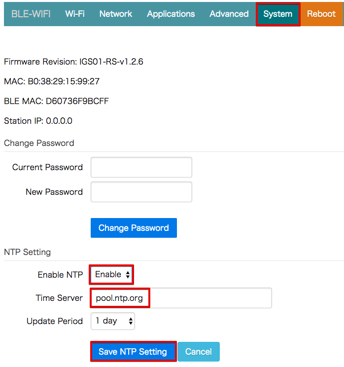
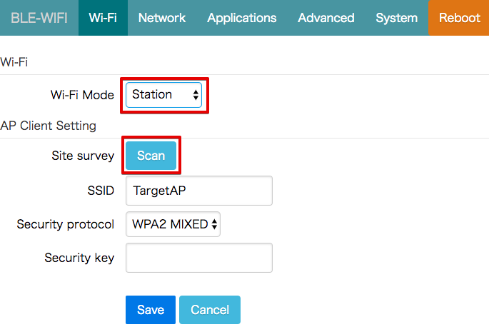
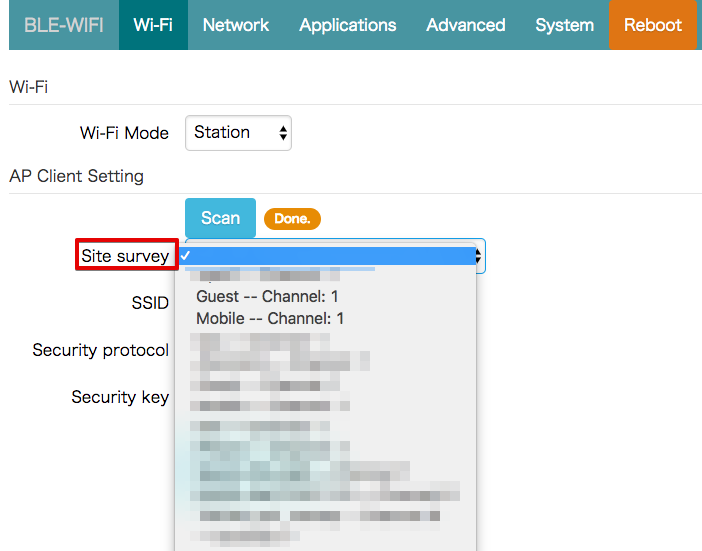
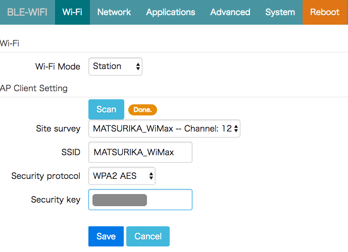

=============================
BLEゲートウェイの設定
=============================

レンジャーシステムズ製のBLEゲートウェイの設定を行います。

電源投入
===================

レンジャーシステムズ製のBLEゲートウェイは、USBで給電する仕組みになっています。

USBケーブルを本体に接続し、電源供給元(USBコンセント、PCのUSBポート等)に接続してください。

ゲートウェイを初期化する
============================

ゲートウェイの電源が入った状態で、本体裏面にあるリセット用ボタンを5秒以上長押しすると、工場出荷状態に戻すことが出来ます。クリップなどでボタンを押して下さい。

|

ゲートウェイにWiFiで接続する
=================================

本ゲートウェイは、工場出荷状態ではWiFiアクセスポイント(親機)モードになっており、PCから直接WiFiで接続し、設定を行います。

電源投入後、ゲートウェイの起動が終わると、WiFi接続が可能なPC等のネットワーク画面で「BLE-WIFI_YY_ZZ」というSSIDが表示されます。

* ハンズオンで使用するゲートウェイのモデル名は、iGS01です。SSIDは、「BLE-WIFI_YY_ZZ」になります。
* ゲートウェイのモデルがiGS02の場合、SSIDは、「IGS02_YY_ZZ」になります。
* YY_ZZ は、ゲートウェイの背面に記録されているMACアドレスの下２桁になります。
  * モデルがiGS01で、MACアドレスが "B03829159927" の場合、SSIDは、"BLE-WIFI_99_27"になります。

  .. image:: images/03/MAC-01.png

  |

* ご自身のゲートウェイのSSIDに接続して下さい。
  * WiFiのパスワードは、"12345678"です。

ゲートウェイに接続したまま、インターネットブラウザで「192.168.10.1」にアクセスするとゲートウェイの設定画面 が表示されます。
ユーザー名とパスワードを求めるポップアップが表示されますので、以下を入力し、ログインしてください。

【ユーザー名】admin
【パスワード 】admin

|

クラウド接続の設定
============================

「Applicatoins」タブをクリックし、ゲートウェイがAWS IoTに接続するための設定を行って下さい。最後に、[Save] ボタンを押して設定を保存します。

Rebootを促すメッセージが出ますが、Rebootしないで下さい。

================ ============================
項目                値
================ ============================
Application	      MQTT Client
Host/IP	          記録しておいたEndpoint情報
Port        	    8883 (1883になっているので注意して下さい)
Publish Topic	    sensor/<参加者番号> (AWS IoTのルールエンジンで使用します。)
Client ID         ranger-gw-<参加者番号> ([Create thing]で作ったThing名)
Username          空欄
Password          空欄
MQTTS             Enable
Root CA           AWSIoT Root CA
Use Certificate   Enable
================ ============================

|

証明書の登録
=====================

「Advanced」タブクリックし、AWS IoTで作成した証明書をインポートします。

"Certificate"の横の[ファイルを選択] ボタンを押して、「証明書の作成」のセクションで保存しておいた証明書を選択し、[Upload Certificate] ボタンを押して、証明書をアップロードして下さい。

"Key"の横の[ファイルを選択] ボタンを押して、保存しておいた認証鍵を選択し、[Upload Key] ボタンを押して、認証鍵をアップロードして下さい。

============ ========================================
項目           ファイル
============ ========================================
Certificate	  xxxxxxxxxx-certificate.pem.crt (証明書)
Key           xxxxxxxxxx-private.pem.key (認証鍵)
============ ========================================

|

正常にアップロードが終わると、下記の様に証明書の内容が表示されます。
まだ、Rebootしないで下さい。

|

BLEフィルター設定
===========================

レンジャーシステムズのBLEゲートウェイは、周囲の受信可能なBeaconを全て受信する仕様です。目的のセンサーのBeaconだけを受信するには、BLEフィルター設定を行います。今回のハンズオンでは、温湿度センサー(iBS01T)を使用しますので、BLE Beaconのパターン設定を行います。最後に、[Save] ボタンを押して設定を保存します。

この設定により、周囲のBeaconの中から、温湿度センサー(iBS01T)のBeaconだけを取得できるようになります。設定画面上部のRSSIは、取得するBeaconの電波強度です。近くのBeaconだけを受信したい場合に使用します。今回は設定しません。

まだ、Rebootしないで下さい。

================== =============================================
項目                 値
================== =============================================
Payload Pattern     02010612FF590080BC4D0100D80A2D00000000000000
Payload Mask        FFFFFFFFFFFFFFFFFF00000000000000000000000000
================== =============================================

|

タイムサーバーの設定
===============================

AWS IoTにデータを送信する際、ゲートウェイは、時刻情報を付加します。
「System」タブをクリックし、タイムサーバーの設定を行います。
この設定を行わないと、センサーデータの取得日時が1970年になってしまいますので、必ず設定して下さい。"NTP Setting" に下記を設定してください。

================== =============================================
項目                 値
================== =============================================
Enable NTP          Enable
Time Server         pool.ntp.org  (自動的に入力されます。)
Update Period       10 mins
Update Period       1 day
================== =============================================

最後に、[Save NTP Setting] ボタンを押して、設定を保存します。

まだ、Rebootしないで下さい。

|

WiFi設定
=====================

WiFi設定を変更し、インターネットに接続出来るWiFiアクセスポイントに接続します。
[Wi-Fi] タブをクリックし、Wi-Fi設定画面に移動します。

|

"Wi-Fi Mode"を"Station"に変更し、[Scan] ボタンを押して周囲のアクセスポイントを探索します。探索が終了すると、"Done."と表示されます。"Site survey"から、接続対象のアクセスポイントを選んでください。

|

"Security protocol"は、自動的に設定されます。
"Security key"にWiFiのパスワードを入力し、[Save] ボタンを押して設定を保存します。

|

最終確認
=====================

ゲートウェイの設定を再度確認して下さい。
ゲストWiFiを使用している場合、Reboot後にゲートウェイのIPアドレスを知る事が難しいため、ゲートウェイの再設の変更が出来なくなる場合があります。その場合、ゲートウェイを初期化して、最初から設定をやり直す必要があります。ご注意下さい。

再起動
====================

「Reboot」タブをクリックし、ゲートウェイを再起動して下さい。

.. image:: images/03/reboot.png

|

念のため、一度、USBケーブルを抜いて再起動して下さい。

センサーの電源を入れる
=========================

センサーのスライドスイッチをスライドさせて、電源を入れて下さい。

Beaconの送信が始まります。

.. image:: images/03/sensor-power-on-off.png

|
