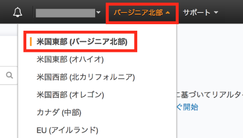
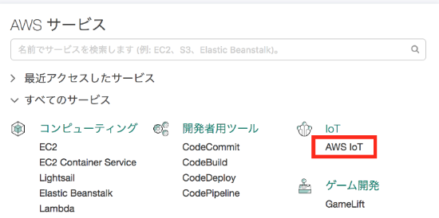
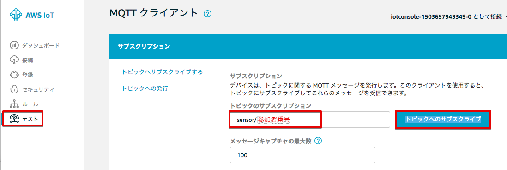
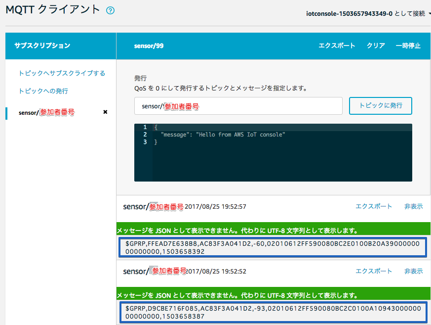
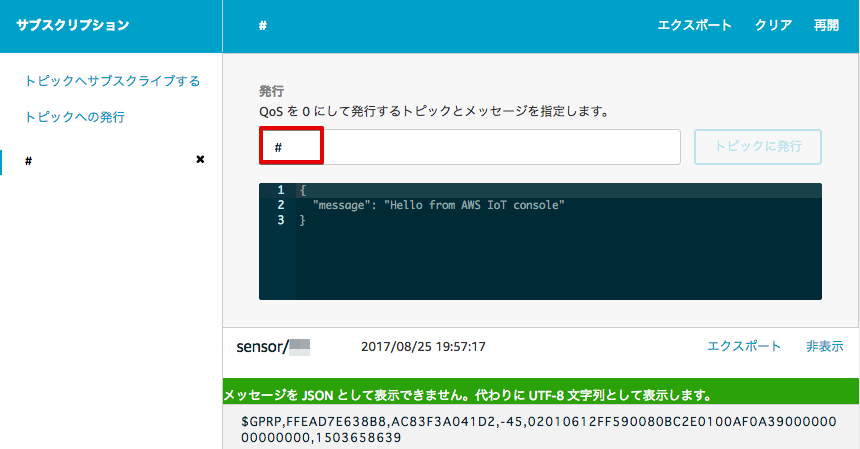

======================
センサーデータの確認
======================

AWS IoTでセンサーデータを確認する
===================================

AWSマネージメントコンソールを開き、右上のリージョンが、[米国東部(バージニア北部)] になってるか確認して下さい。

|

サービス一覧から[AWS IoT]をクリックして開きます。

|

テスト画面を表示します。メニューから[Test]をクリックすると下記の画面が表示されます。
"Subscription topic" に "sensor/<参加者番号>" を入力し、[Subscribe to topic] ボタンを押します。

|

AWS IoTがゲートウェイからのデータを受信できていれば、"sensor/<参加者番号>" の左に、赤色の ● が表示されます。

|

"● sensor/<参加者番号>" をクリックすると、AWS IoTが受信したセンサーデータが表示されます。

|

ゲートウェイが送信するデータは、下記の様なフォーマットになっています。

::

  $GPRP,C02C61CB558F,AC83F3A041D2,-44,02010612FF590080BC440104FFFFFFFFFFFFFFFFFFFF,1493638145

|

============================== ===============================================
項目                             説明
============================== ===============================================
$GPRP                           ヘッダー
C02C61CB558F                    BLEセンサーのBDアドレス (Bluetooth Device Address = MACアドレス)
AC83F3A041D2                    ゲートウェイのBDアドレス
-44                             Beaconの電波強度 (RSSI, dBm単位)
02010612FF590080BC4D0100D8...   Beaconのデータ (Payload)
1493638145                      ゲートウェイが付加したタイムスタンプ
============================== ===============================================

温湿度センサーが送信するBeaconデータは、下記になります。

::

  02010612FF590080BC4D0100D80A2D00000000000000

|

============ ===========================
項目           説明
============ ===========================
02010612FF    BLE情報
5900          企業コード
80BC          センサーのモデル番号
4D01          電池電圧 (0x014D = 3.33V)
00            センサーステータス (b0:ボタン)
D80A          温度 (0x0AD8 = 27.76℃)
2D00          湿度 (0x002D = 45%)
============ ===========================

本ハンズオンでは、Lambda関数を使用して、Beaconデータを活用が容易な JSON形式 のデータに加工して使用します。
