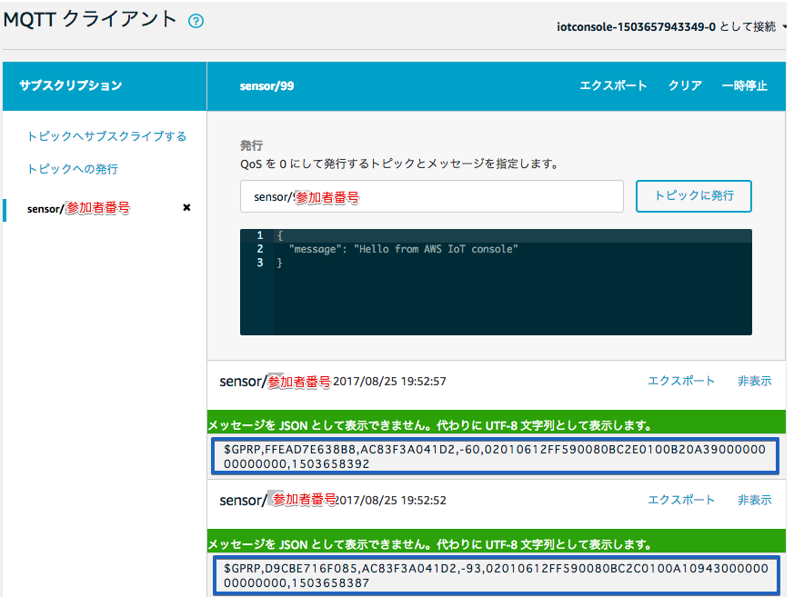
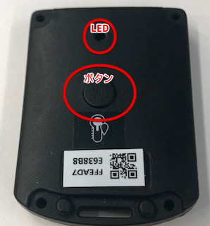

======================
センサーデータの確認
======================

AWS IoTでセンサーデータを確認する
===================================

AWS IoTのマネジメントコンソールでは、指定したトピックをサブスクライブ(購読)する事が可能です。BLEゲートウェイの設定で、"Publish Topic"として、"sensor/<参加者番号>"を設定していましたので、確認してみましょう。

まず、AWSマネージメントコンソールを開き、右上のリージョンが、[米国東部(バージニア北部)] になってるか確認して下さい。

.. image:: images/02/regions-us@2x.png

|

サービス一覧から[AWS IoT]をクリックして開きます。

.. image:: images/02/iot-servicemenu@2x.png

|

テスト画面を表示します。メニューから[テスト] をクリックすると下記の画面が表示されます。
"トピックのサブスクリプション" に "sensor/<参加者番号>" と入力し、[トピックへのサブスクライブ] ボタンを押します。これで、AWS IoTマネージメントコンソールで、トピック "sensor/<参加者番号>"をサブスクライブできるようになりました。

|

AWS IoTが受信したセンサーデータが５秒毎に表示されます。

|

何も表示されない場合、温湿度センサーの電源が入っているか確認して下さい。電源が入っていれば、温湿度センサーのボタンを押すとLEDが緑色に点灯します。電源が入っていても、テストでデータが表示されない場合、トレーナーに問い合わせて下さい。

|

ゲートウェイが送信するデータは、下記の様なCSV形式になっています。

::

  $GPRP,C02C61CB558F,AC83F3A041D2,-44,02010612FF590080BC440104FFFFFFFFFFFFFFFFFFFF,1493638145

|

各データの内訳は、下記の様になっています。

============================== ===============================================
項目                             説明
============================== ===============================================
$GPRP                           ヘッダー
C02C61CB558F                    BLEセンサーのBDアドレス
AC83F3A041D2                    ゲートウェイのBDアドレス
-44                             Beaconの電波強度　(RSSI, dBm単位)
02010612FF590080BC4D0100D8...   Beaconのデータ　(Payload)
1493638145                      ゲートウェイが付加したタイムスタンプ
============================== ===============================================

※ BDアドレスとは、BluetoothデバイスのMACアドレスです。
  (Bluetooth Device Address)

温湿度センサーが送信するBeaconデータの中身(Payload)は、下記の様なバイナリデータになっています。

::

  02010612FF590080BC4D0100D80A2D00000000000000

|

このバイナリデータの内訳は、下記の様になっています。

============ ===========================
項目           説明
============ ===========================
02010612FF    BLE情報
5900          企業コード
80BC          センサーのモデル番号
4D01          電池電圧 (0x014D = 3.33V)
00            センサーステータス (b0:ボタン)
D80A          温度 (0x0AD8 = 27.76℃)
2D00          湿度 (0x002D = 45%)
============ ===========================

本ハンズオンでは、Lambda関数を使用して、バイナリ形式のBeacon payloadを活用が容易な JSON形式 のデータに加工して使用します。

AWS IoTのテスト画面で、"Subscription topic"に "#" と入力し、[Subscribe to topic] ボタンを押すと、BLEゲートウェイがAWS IoTに送信した全てのメッセージを見ることができます。複数の参加者で1つのAWSアカウントを共用している場合は、他のユーザーのBLEゲートウェイからのデータも見ることができます。

|

**トピックのワイルドカード**

AWS IoTでは、トピックを指定する場合、ワイルドカードを指定できます。"#"は、トピック名の末尾の任意の文字列に合致します。Sensor/# へのサブスクリプションは、sensor/01, sensor/02, sensor/03, sensor/01/pppp ... にマッチし、全てのIAMユーザのデータを見ることができます。

ワイルドカード "+"も使用可能です。
"+"は、トピック階層内の 1 つの項目に完全に一致します。たとえば、Sensor/+/room1 へのサブスクリプションでは、Sensor/temp/room1、Sensor/moisture/room1 などにパブリッシュされたメッセージを受信します。
