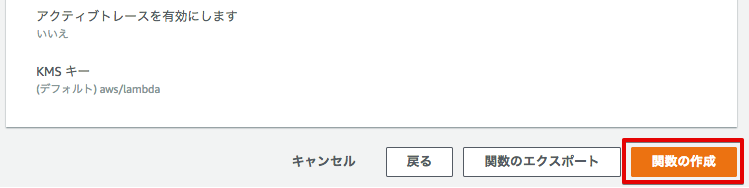
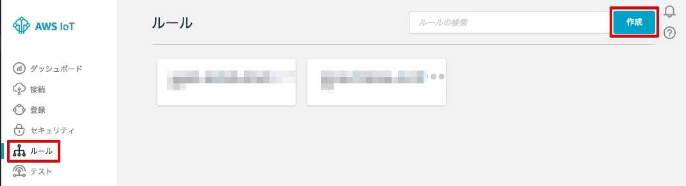

=====================================
シナリオ2: センサーデータを可視化する-1
=====================================

LambdaでJSON形式に変換されたセンサーデータをAWS IoTへトピック名を換えてPublishし、そのトピックをWebアプリケーションでSubscribeしグラフ表示します。

.. image:: images/06/overview.png

|

データ変換用のLambda関数を準備する
======================================

レンジャーシステムズ製のBLEゲートウェイがpublishするトピックは、"sensor/<参加者番号>" でしたが、Lambda関数でJSON形式に変換し、トピック名 "sensor/<参加者番号>/json" として、AWS IoTに再度publishします。

まず、Lambda関数を下記のリンクからPCにダウンロードして下さい。このzipファイルは、後ほどLambdaの設定画面でアップロードします。

https://s3-ap-northeast-1.amazonaws.com/awsiot-handson-dojo-jp/sensor-raw-data-to-json-mqtt-publish.zip

サービス一覧から[Lambda] をクリックして開きます。

.. image:: images/05/lambda.png

|

Lambda関数の設定画面が表示されるので、[Lambda 関数の作成] ボタンをクリックします。

.. image:: images/06/create-lambda-func.png

|

Lambda関数の作成画面が表示されるので、[Blunk Function] もしくは、[ブランク関数]をクリックします。

.. image:: images/06/blank-function.png

|

トリガーの設定画面が表示されるので、[次へ]をクリックします。

.. image:: images/06/lambda-trigger.png

|

ダウンロード済みのLambda関数のZIPファイルをアップロードします。
下記のような画面が表示されるので、必要事項を入力し、[アップロード] ボタンをクリックして、アップロードして下さい。
ロール：[カスタムロールの作成] を選択すると、別画面でIAMの設定画面が出てきますので、設定に従って、ロールの設定を行って下さい。

=========================== =======================================
項目                          設定
=========================== =======================================
名前                           sensor-raw-data-to-json-mqtt-publish-<参加者番号>
説明                           To convert input raw data from BLE GW to JSON
ランタイム                       Python 2.7
コード エントリ タイプ                 ZIPファイルをアップロード
関数パッケージ                        sensor-raw-data-to-json-mqtt-publish.zip (先ほどダウンロードしたもの)
ロール                         カスタムロールの作成
=========================== =======================================

.. image:: images/06/lambda-1.png

|

IAMの設定画面では、[新しいIAMロールの作成] を選択し、ロール名を入力し、[ポリシードキュメントを表示] をクリックして下さい。

=================== =======================================
項目                    設定
=================== =======================================
IAM ロール              新しいIAMロールの作成
ロール名                lambda_awsiot_mqtt_publish-<参加者番号>
=================== =======================================

.. image:: images/06/lambda-role.png

|

[編集] をクリックし、下記のポリシードキュメントを入力して下さい。[許可] をクリックするとIAMの設定画面は閉じます。

.. image:: images/06/lambda-role-2.png

|

::

  {
      "Version": "2012-10-17",
      "Statement": [
          {
              "Effect": "Allow",
              "Action": "iot:*",
              "Resource": "*"
          },
          {
              "Action": [
                  "logs:CreateLogGroup",
                  "logs:CreateLogStream",
                  "logs:PutLogEvents"
              ],
              "Effect": "Allow",
              "Resource": "arn:aws:logs:*:*:*"
          }
      ]
  }

|

ロールが[既存のロール] に変更され、ロール名として、"lambda_awsiot_mqtt_publish-<参加者番号>" が表示されていることを確認し、[次へ] をクリックして下さい。

.. image:: images/06/lambda-role-3.png

|

確認画面が表示されますので、下までスクロースし、[関数の作成] をクリックして下さい。

|

Lambda関数の作成に成功すると、下記の様な画面が表示されます。

.. image:: images/06/edit-lambda-func.png

|

Lambda関数内でAWS SDKのboto3をインポートしますが、使用中のリージョンになっているか確認して下さい。(バージニア リージョンの場合、'us-east-1')

目的のセンサーからのデータだけを取り込むために、Lambda関数内の"my_temphumid_sensor_mac" を修正します。
ご自身のセンサーのラベルに記載されているセンサーのMACアドレスに修正し、[保存] ボタンを押して下さい。これによって、ご自身のセンサーのデータだけがLambda関数で処理されるようになります。","カンマで区切れば、複数のセンサーの登録も可能です。

.. image:: images/06/edit-lambda-func-2.png
.. image:: images/05/src_mac.png

|

Lambda起動用のAWS IoT ルールを作成
=================================================

サービス一覧から[AWS IoT]をクリックして開きます。

.. image:: images/02/iot-servicemenu@2x.png

|

ルールを作成します。メニューから[Rules]をクリックします。ルール一覧画面で、[Create]をクリックします。

|

下記の項目を入力し、[Add action]をクリックします。

============= ====================================
設定項目             値
============= ====================================
Name	         awsiot_lambda_direct_<参加者番号>
Attribute	     encode(*, 'base64') as payload, topic() as topic_name
Topic filter   sensor/<参加者番号>
============= ====================================

.. image:: images/06/create-rule.png

|

※ レンジャーシステムズ製のBLEゲートウェイが送信するデータは、CSV形式であるため、Lambdaで受け取る事が出来ません。
  ルールエンジンの組み込み関数 "Encode()"を使用する事で、非JSONのデータをエンコードし、Lambdaに渡せる様になります。
  今回は、キー payloadとして、センサーデータをエンコードしています。
  詳しくは、下記をご参照下さい。
  http://docs.aws.amazon.com/ja_jp/iot/latest/developerguide/iot-sql-functions.html
  topic() as topic_name は、受信したトピック名 "sensor/<参加者番号>" をキー "topic_name"として、Lambdaに渡しています。
  実際にLambdaが受け取っているデータは、下記になります。

::

  {
    'topic_name': 'sensor/<参加者番号>',
    'payload': 'JEdQUlAsRkZFQUQ3RTYzOEI4LEFDODNGM0EwNDFEMiwtNjMsMDIwMTA2MTJGRjU5MDA4MEJDNEUwMTAwMUIwOTJDMDAwMDAwMDAwMDAwMDAsMTQ5NzI1MjM5MQ0K'
  }

|

"Invoke a Lambda function passing the message data" を選択し、[Confgure action] をクリックします。

.. image:: images/06/select-action-1.png
.. image:: images/06/select-action-2.png

|

Function nameで、sensor-data-to-es-<参加者番号> を選択し、[Add action] をクリックします。
この時点で、

============= ====================================
設定項目           値
============= ====================================
Function name   sensor-raw-data-to-json-mqtt-publish-<参加者番号>
============= ====================================

.. image:: images/06/add-action.png

|

Create a rule画面に戻ります。[Create rule]  をクリックして、ルールを作成します。

.. image:: images/06/create-rule-2.png

|

Lambda関数でpublishされたデータを確認する
============================================

Gatewayがpublishするトピックは、"sensor/<参加者番号> でしたが、Lambda関数でJSON形式に変換し、トピック名 "sensor/<参加者番号>/json" として、AWS IoTにpublishしています。AWS IoTのTestから、変換されたデータを確認してみましょう。

テスト画面を表示します。AWS IoTのメニューから[Test]をクリックすると下記の画面が表示されます。
"Subscription topic" に "sensor/<参加者番号>/#" と入力し、[Subscribe to topic] ボタンを押します。

.. image:: images/06/test.png

|

左に、sensor/<参加者番号>/# と表示されますので、クリックします。

Lambda関数が正しくデータ変換できていれば、下記の様にトピック名 "sensor/<参加者番号>/json" として、JSON形式に変換されたデータが表示されます。

.. image:: images/06/test-2.png

|

JSON形式に変換されたデータ、下記のフォーマットになっています。

::

  {
    "dst_mac": "AC83F3A041D2",             ← ゲートウェイのMACアドレス
    "timestamp": "2017-06-12T06:21:22",    ← タイムスタンプ
    "tempreature": 23.41,                  ← 温度
    "humidity": 43,                        ← 湿度
    "vbat": 3.34,                          ← 電池電圧
    "unixtime": "1497248482",              ← UNIX形式のタイムスタンプ (1970/01/01 00:00:00 UTC) からの経過秒数)
    "rssi": -64,                           ← Beaconの電波強度
    "sensor": "Tempreature and Humidity",  ← センサーのタイプ
    "src_mac": "FFEAD7E638B8"              ← センサーのMACアドレス
  }

|

表示されない場合は、Lambda関数内の"my_temphumid_sensor_mac" の修正が間違っていないかなど、確認して下さい。

Webアプリケーションでデータを確認
=======================================

下記のURLをクリックし、WebアプリケーションをPCのWebブラウザで開いて下さい。
      http://awsiot-linechart.s3-website-ap-northeast-1.amazonaws.com

下記のデモ画面が表示されますので、[Auto Refresh with AWS IoT Data]をクリックして、AWS IoTのデータを表示する画面に切り替えて下さい。

.. image:: images/06/web-app-open.png

|

AWS IoTのグラフ表示画面が表示されます。

.. image:: images/06/web-app-iot.png

|

エンドポイントやトピック名などの必要事項を入力し、最後に [Start]ボタンを押して下さい。

======================= ======================================
項目                       値
======================= ======================================
Endpoint URL              記録しておいたEndpoint情報
accessKeyId               AWSアカウント もしくは、ユーザーのアクセスキーID
secretAccessKey           AWSアカウント もしくは、ユーザーのシークレットアクセスキー
Topic                     sensor/<参加者番号>/json
Display last n data       200 (グラフに表示する過去のデータ数)
======================= ======================================

※ アクセスキーは、AWSにアクセスするための認証情報です。
  詳しくは、下記をご参照下さい。
  https://aws.amazon.com/jp/developers/access-keys/

暫くすると、温度、湿度のグラフが表示されます。電波強度は、Gatewayが受信したBeaconの電波強度です。
温湿度センサーは、5秒毎にBeaconを送信するため、グラフも5秒周期で更新されます。

.. image:: images/06/web-app-linechart.png

|
