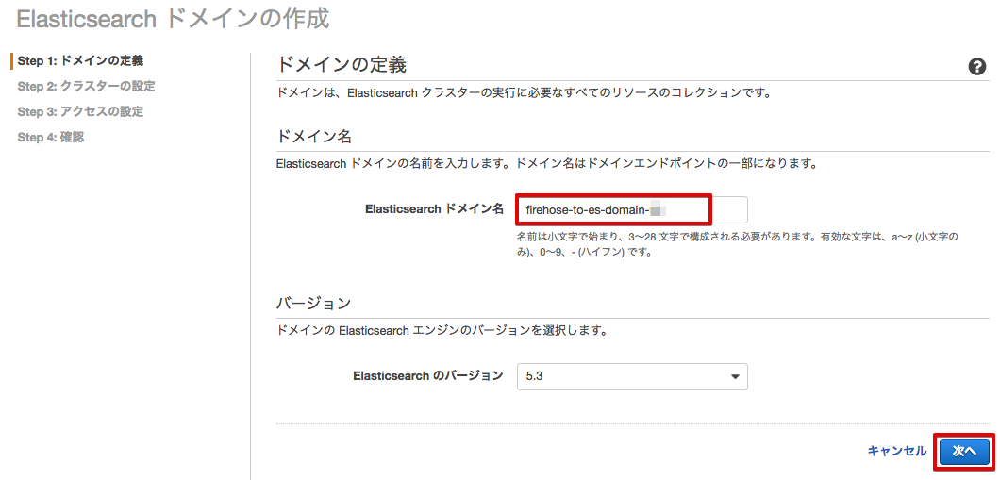
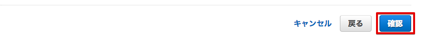
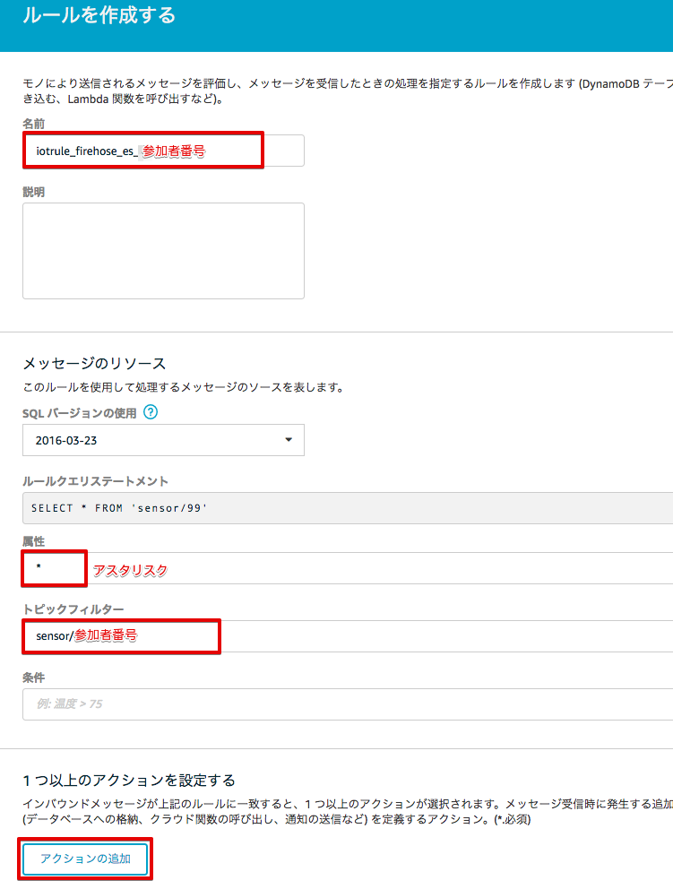

=====================================
シナリオ2+: センサーデータを可視化する-2
=====================================

Lambdaで変換されたセンサーデータをElasticSearch Serviceへ送り、Kibanaでグラフ表示します。データ変換には、シナリオ1で使用したLambda関数を使用します。

.. image:: images/07/overview.png

|

ElasticSearch Serviceのドメインを作成する
==============================================

サービス一覧から[ElasticSearch Service] をクリックして開きます。

.. image:: images/07/es.png

|

Elasticsearch Serviceの画面が開きますので、[Get started] をクリックして下さい。

|

Create Elasticsearch domain画面になります。

Elasticsearch domain nameに、"firehose-to-es-domain-<参加者番号>" と入力して、[Next]をクリックして下さい。

|

次の画面では、何も入力せずに、[Next]をクリックして下さい。
Set the domain access policy toで、"Allow open access to the domain"を選択して下さい。

.. image:: images/07/domain-access-policy.png

|

確認画面が表示されるので、I accept the risk をチェックし、[OK] を押して下さい。

.. image:: images/07/domain-access-policy-risk-confirm.png

|

access policyが表示されるので、[Next]をクリックして下さい。

.. image:: images/07/domain-access-policy-2.png

|

確認画面が出てきますので、[Confirm and create]をクリックして下さい。
Elasticsearch ドメインが出来るまで、数分かかります。

|

Kinesis Firehoseの設定
===============================

サービス一覧から[Kinesis]をクリックして開きます。

Kinesisの画面が開きますので、[Firehose コンソールに移動] をクリックして下さい。

[Create Delivery Stream] をクリックして下さい。

.. image:: images/05/create-delivery-stream.png

|

[Create Delivery Stream] をクリックして下さい。

DestinationをElasticsearch Serviceとして、Delivery stream nameを設定し、先ほど設定したElasticsearch ドメインを選んで、[Next] をクリックして下さい。

======================= =======================================
項目                      設定
======================= =======================================
Destination              Amazon Elasticsearch Service
Delivery stream name     sensor-data-to-es-<参加者番号>
Elasticsearch domain     firehose-to-es-domain-<参加者番号>
Index                    sensordata
Type                     scenario2
S3 bucket                sensor-data-<参加者番号>
======================= =======================================

.. image:: images/07/cretae-delivery-stream.png

|

Lambdaでデータ変換を行いますので、Data transformation を有効にして、Lambda関数を選んで下さい。

=================== =======================================
項目                    設定
=================== =======================================
Data transformation    Enable
Lambda function        ranger-raw-data-to-json-<参加者番号>
Buffer interval        60 (Elasticsearch Serviceに60秒周期でデータが追加されます)
Error Logging          Disable
IAM role               Firehose delivery IAM role
=================== =======================================

.. image:: images/07/cretae-delivery-stream-2.png

.. image:: images/07/cretae-delivery-stream-3.png

|

IAM role で、"Firehose delivery IAM role" を選択すると、IAM roleの設定画面が開きます。

"新しい IAMロールの作成" を選択し、ロール名を入力して、[許可] をクリックすると、Firehoseの設定画面に戻ります。

=================== =======================================
項目                    設定
=================== =======================================
IAM ロール              新しい IAMロールの作成
ロール名                firehose_delivery_role_es-<参加者番号>
=================== =======================================

.. image:: images/07/firehose-iam-role.png

|

Firehoseの設定画面で、[Next] をクリックして下さい。

.. image:: images/07/cretae-delivery-stream-4.png

|

最後に、[Create Delivery Stream] をクリックして下さい。

.. image:: images/07/cretae-delivery-stream-5.png

|

Elasticsearch Delivery Streamsの作成が開始されました。

.. image:: images/07/cretae-delivery-stream-6.png

|

Kinesis Firehose用のAWS IoT ルールを作成
=================================================

サービス一覧から[AWS IoT]をクリックして開きます。

.. image:: images/02/iot-servicemenu@2x.png

|

ルールを作成します。メニューから[Rules]をクリックします。ルール一覧画面で、[Create]をクリックします。

.. image:: images/05/create-rule-2.png

|

下記の項目を入力し、[Add action]をクリックします。

============= ====================================
設定項目         値
============= ====================================
Name	         iotrule_firehose_es_<参加者番号>
Attribute	     * (＊ アスタリスク)
Topic filter   sensor/<参加者番号>
============= ====================================

|

"Send messages to an Amazon Kinesis Firehose stream" を選択し、[Confgure action] をクリックします。

.. image:: images/05/select-action.png

|

Stream nameで、sensor-data-to-es-<参加者番号> を選択し、シナリオ1で作成したIAM roleを選択し、[Update role] をクリックします。
Successfully updated role. と表示されたら、[Add action] をクリックします。

============= ====================================
設定項目         値
============= ====================================
Stream name     sensor-data-to-es-<参加者番号>
IAM role name   IOT_to_Kinesis_Firehose-<参加者番号>
============= ====================================

|

Create a rule画面に戻ります。[Create rule]  をクリックして、ルールを作成します。

|

Kibanaでデータを確認
==============================

マネージメントコンソールのサービス一覧から[Elasticsearch Service]を開きます。

ElasticSearchDomainの[Searchable documents]の数字が1より大きくなっていることを確認します。[Cluster health]が[Yellow]になっていのはシングルノード構成のためでありハンズオンでは問題ありません。

|

[Domain]のいリンクをクリックして開きます。[Kibana]のリンクをクリックして開きます。

.. image:: images/07/kibana-link.png

|

Kibanaで表示させるindexを指定します。以下の値を入力して、[Create]をクリックします。
60秒周期でElasticSearch Serviceにデータが追加される設定になっているため、@timestamp 現れるまで数分かかることがあります。

======================  =========================
設定項目                  値
======================  =========================
Index name or pattern   sensordata
Time-field names        @timestamp (リストから選択)
======================  =========================

.. image:: images/07/kibana-index-create.png

|

tempreature, humidity, rssi, @timestamp のフィールドが表示されている事を確認します。

.. image:: images/07/kibana-indices.png

|

メニューにある[Discover]をクリックし、データが届いている事を確認します。

.. image:: images/07/kibana-discover.png

|

メニューにある[Visualize]をクリックし、グラフの種類として[Line chart]を選択します。

.. image:: images/07/kibana-visualize.png

|

[From a new search]から、"sensordata"を選択します。

.. image:: images/07/kibana-sensordata.png

|

データに[sensordata]が選択され、Y軸にサンプル数(Count)が設定されている事を確認し、X軸の設定を開始するために[X-Axis]をクリックします。

.. image:: images/07/kibana-count.png

|

[Aggregation]に[Data Histogram]を選択し[▶]をクリックすると、右側にグラフが表示されることを確認します。

.. image:: images/07/kibana-count-graph.png

|

[Save] ボタンをクリックし、[Title]に[Sensor Data - Sampling Count]と入力し、[Save]をクリックします。

.. image:: images/07/kibana-save-count.png

|

保存されたら、Y軸の設定を表示し、[Aggregation]を[Average]に変更し、[Field]に[tempreature](温度)を指定します。[▶]をクリックしてグラフに適切なデータが表示されることを確認します。

|

[Add metrics]をクリックし、湿度データを追加します。[Y-Axis]をクリックし、[Aggregation]を[Average]に変更し、[Field]に[humidity](湿度)を指定します。[▶]をクリックしてグラフに適切なデータが表示されることを確認します。

.. image:: images/07/kibana-humid.png

|

Beaconの電波強度(rssi)も同様に追加します。

.. image:: images/07/kibana-rssi.png

|

[Save] ボタンをクリックし、[Title]に[Sensor Data - temp - humid - rssi]と入力し、[Save]をクリックします。

.. image:: images/07/kibana-save-temphumidrssi.png

|

メニューにある[Dashboard]をクリックし、[Add] ボタンをクリックします。

.. image:: images/07/kibana-dashboard.png

|

[ Sensor Data - temp - humid - rssi]をクリックし、下側にグラフが追加されたのを確認します。

.. image:: images/07/kibana-dashboard-add-temphumidrssi.png

|

[Sensor Data - Sampling Count]をクリックし、下側にグラフが追加されたのを確認します。

.. image:: images/07/kibana-dashboard-add-count.png

|

[Save] ボタンをクリックし、[Title]を[Sensor Data]と入力し、[Save]をクリックします。

|

右上の[Last 15 minutes]をクリックすると、表示する期間や表示を自動更新する頻度を変更できます。

.. image:: images/07/kibana-update.png

|

グラフをマウスで操作して、位置やサイズを変更することもできます。

.. image:: images/07/kibana-size-pos.png

|
