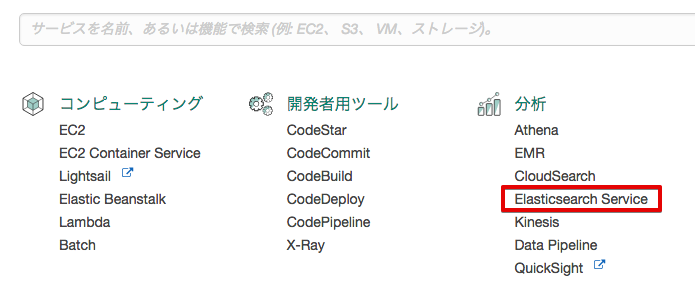
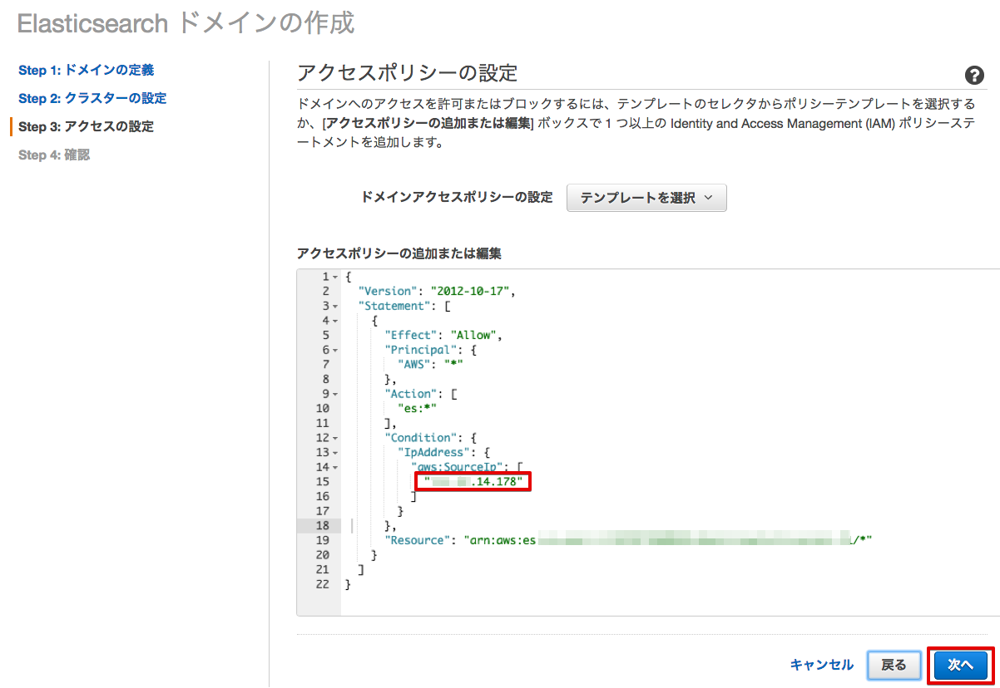
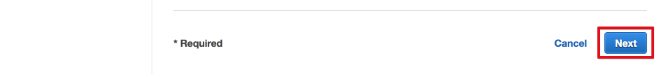
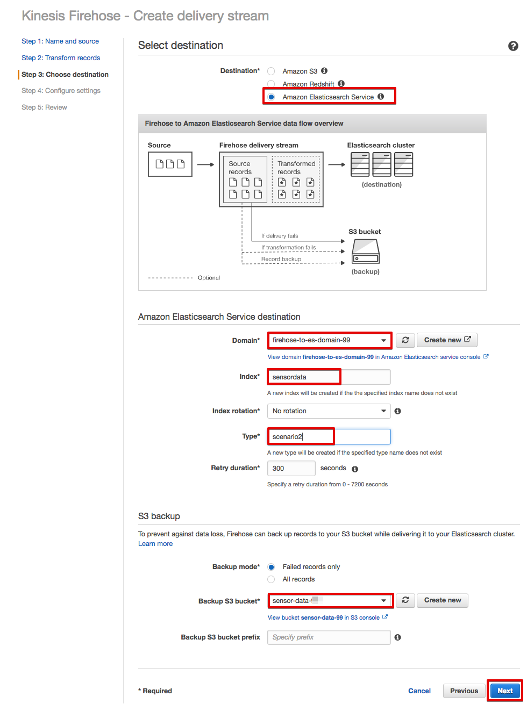
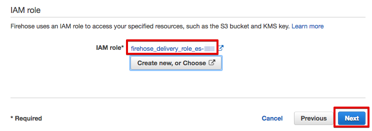

==============================================
シナリオ2+: センサーデータを可視化する-2
==============================================

このシナリオは、オプションです。通常のハンズオンでは、スキップして下さい。

Lambdaで変換されたセンサーデータをElasticSearch Serviceへ送り、Kibanaでグラフ表示します。データ変換には、シナリオ1で使用したLambda関数を使用します。

.. image:: images/07/overview.png

|

グローバルIPアドレスを調べる
==============================================

Kibanaを特定のIPアドレスからだけアクセスさせるために、PCのグローバルIPアドレスを調べます。下記のURLにアクセスしてください。(PCを社内WiFiに接続している場合、Kibanaからアクセスできない場合がありますので、トレーナーが準備したWiFiに接続し直して下さい。)

::

    SSID = awshandson　もしくは　awshandson5、パスワード = awshandson

|

https://www.cman.jp/network/support/go_access.cgi

.. image:: images/07/grobal_ip.png

|

グローバルIPアドレスが表示されるので、ノートパッドなどに記録しておいて下さい。

ElasticSearch Serviceのドメインを作成する
==============================================

サービス一覧から[ElasticSearch Service] をクリックして開きます。

|

Elasticsearch Serviceの画面が開きますので、[新しいドメインの作成] をクリックして下さい。

.. image:: images/07/es-get-started.png

|

「Elasticsearch ドメインの作成」画面になります。

[Elasticsearch ドメイン名]に、"firehose-to-es-domain-<参加者番号>" と入力して、[次へ] をクリックして下さい。

========================== =======================================
項目                          設定
========================== =======================================
Elasticsearch ドメイン名	      firehose-to-es-domain-<参加者番号>
========================== =======================================

.. image:: images/07/cretate-es-domain.png

|

次の画面では、何も入力せずに、[次へ] をクリックして下さい。

「アクセスポリシーの設定」では、 [テンプレートを選択] で、 **特定のIPからのドメインのアクセスを許可** を選択して下さい。

|

IPアドレスの入力画面が表示されるので、先ほど記録した “グローバルIPアドレス” を入力し、[OK] を押して下さい。

.. image:: images/07/domain-access-ip_input.png

|

アクセスポリシー が表示されるので、先ほど入力した“グローバルIPアドレス”を確認して、[次へ] をクリックして下さい。

|

確認画面が出てきますので、[確認] をクリックして下さい。
Elasticsearch ドメインが出来るまで、10数分かかります。

.. image:: images/07/confirm-create.png

|

Kinesis Firehoseの設定
===============================

マネージメントコンソールのサービス一覧から [Kinesis] を開きます。[Firehose コンソールに移動] をクリックします。

.. image:: images/07/kinesis-firehose-1.png

|

[Create Delivery Stream] をクリックして下さい。

.. image:: images/07/create-delivery-stream.png

|

Step 1 で、"Delivery stream name" として、"sensor-data-to-es-<参加者番号>" を設定し、他の設定は、そのままにして [Next] をクリックします。

======================= =======================================
項目                      設定
======================= =======================================
Delivery stream name	   sensor-data-to-es-<参加者番号>
======================= =======================================

|

Step 2 では、Lambda関数を用いた、データ変換の設定を行います。

Lambdaでデータ変換を行いますので、Data transformation を **Enabled** にして、Lambda関数を選んで、[Next] をクリックして下さい。

=================== =======================================
項目                    設定
=================== =======================================
Data transformation    **Enabled**
Lambda function        ranger-raw-data-to-json-<参加者番号>
=================== =======================================

|

Step 3 で、Destination として **Amazon Elasticsearch Service** を選択し、下記の情報を入力し、[Next] をクリックします。

======================= =======================================
項目                      設定
======================= =======================================
Destination              Amazon Elasticsearch Service
Domain                   firehose-to-es-domain-<参加者番号>
Index                    sensordata
Type                     scenario2
Backup S3 bucket         sensor-data-<参加者番号>-<ユニークな文字列>
======================= =======================================

|

Step 4 で、下記を入力し、[Create new, or Choose] ボタンを押します。

=================== ==============================================================
項目                    設定
=================== ==============================================================
Buffer interval        60 (Elasticsearch Serviceに60秒周期でデータが追加されます)
Error Logging          Disable
IAM role               [Create new, or Choose] ボタンを押す
=================== ==============================================================

|

IAM ロール の設定画面が開きます。

"新しい IAMロールの作成" を選択し、ロール名を入力して、[許可] をクリックすると、Firehoseの設定画面に戻ります。

=================== =======================================
項目                    設定
=================== =======================================
IAM ロール              新しい IAMロールの作成
ロール名                firehose_delivery_role_es-<参加者番号>
=================== =======================================

|

設定したIAM ロールが選択されていることを確認し、[Next] をクリックして下さい。

|

最後に、[Create Delivery Stream] をクリックして下さい。

|

Elasticsearch Delivery Streamsの作成が開始されました。

|

Kinesis Firehose用のAWS IoT ルールを作成
=================================================

サービス一覧から[AWS IoT]をクリックして開きます。

.. image:: images/02/iot-servicemenu@2x.png

|

ルールを作成します。メニューから [ルール] をクリックします。ルール一覧画面で、[作成] をクリックします。

.. image:: images/05/create-rule-2.png

|

下記の項目を入力し、[アクションの追加] をクリックします。

==================== ====================================
設定項目                 値
==================== ====================================
名前	                   iotrule_firehose_es_<参加者番号>
属性	                   \*
トピックフィルター         sensor/<参加者番号>
==================== ====================================

"*"は、半角の＊(アスタリスク)です。

.. image:: images/07/create-rule.png

|

"Amazon Kinesis Firehoseストリームにメッセージを送信する" を選択し、[アクションの設定] をクリックします。

|

"ストリーム名" として、sensor-data-to-es-<参加者番号> を選択し、シナリオ1で作成したIAM roleを選択し、[ロールの更新] をクリックします。
"ロールは正常に更新されました。" と表示されたら、[アクションの追加] をクリックします。

============== ====================================
設定項目          値
============== ====================================
ストリーム名       sensor-data-to-es-<参加者番号>
IAM ロール名      IOT_to_Kinesis_Firehose-<参加者番号>
============== ====================================

.. image:: images/07/add-action.png

|

「ルールを作成する」画面に戻ります。[ルールを作成する] をクリックして、ルールを作成します。

.. image:: images/07/create-rule-3.png

|

Kibanaでデータを確認
==============================

マネージメントコンソールのサービス一覧から[Elasticsearch Service]を開きます。

"ElasticSearch ドメイン" の [検索可能なドキュメント] の数字が 1より大きくなっていることを確認します。[Cクラスターの状態] が [黄色] になっていのはシングルノード構成のためでありハンズオンでは問題ありません。

.. image:: images/07/es-dashboard.png

|

[ドメイン] のリンクをクリックして "firehose-to-es-domain-<参加者番号>" を開きます。[Kibana]のリンクをクリックして開きます。

|

Kibanaで表示させるindexを指定します。以下の値を入力して、[Create]をクリックします。
60秒周期でElasticSearch Serviceにデータが追加される設定になっているため、@timestamp 現れるまで数分かかることがあります。

======================  =========================
設定項目                   値
======================  =========================
Index name or pattern     sensordata
Time-field names          @timestamp (リストから選択)
======================  =========================

.. image:: images/07/kibana-index-create.png

|

tempreature, humidity, rssi, @timestamp のフィールドが表示されている事を確認します。

.. image:: images/07/kibana-indices.png

|

メニューにある [Discover] をクリックし、データが届いている事を確認します。

.. image:: images/07/kibana-discover.png

|

メニューにある[Visualize]をクリックし、[+ Create a visualization]をクリックします。

|

グラフの種類として[Line chart]を選択します。

.. image:: images/07/kibana-visualize.png

|

[From a new search]から、"sensordata"を選択します。

.. image:: images/07/kibana-sensordata.png

|

Indexとして [sensordata] が選択され、Y軸にサンプル数(Count)が設定されている事を確認し、X軸の設定を開始するために[X-Axis]をクリックします。

.. image:: images/07/kibana-count.png

|

[Aggregation]に[Data Histogram]を選択し[▶]をクリックすると、右側にグラフが表示されることを確認します。

.. image:: images/07/kibana-count-graph.png

|

[Save]① をクリックし、[Title] に ② "Sensor Data - Sampling Count]" と入力し、その下にある [Save]③ をクリックします。

|

保存されたら、①Y軸(Y-Axis)の設定を表示し、[Aggregation] を [Average] に変更し、[Field] に ③[tempreature](温度)を指定します。④[▶]をクリックしてグラフに適切なデータが表示されることを確認します。

.. image:: images/07/kibana-temp.png

|

[Add metrics] をクリックし、湿度データを追加します。①[Y-Axis] をクリックし、[Aggregation] を ②[Average] に変更し、[Field] に ③[humidity](湿度)を指定します。④[▶] をクリックしてグラフに適切なデータが表示されることを確認します。

|

Beaconの電波強度(rssi)も同様に追加します。

.. image:: images/07/kibana-rssi.png

|

①[Save] ボタンをクリックし、[Title] に ②"Sensor Data - temp - humid - rssi" と入力し、③"Save a new visualization"にチェックを入れ。④[Save]をクリックします。

|

メニューにある[Dashboard]をクリックします。[+ Create a dashboard] します。

|

[Add] ボタンをクリックします。

|

[ Sensor Data - temp - humid - rssi] をクリックし、下側にグラフが追加されたのを確認します。

.. image:: images/07/kibana-dashboard-add-temphumidrssi.png

|

[Sensor Data - Sampling Count]をクリックし、下側にグラフが追加されたのを確認します。

.. image:: images/07/kibana-dashboard-add-count.png

|

①[Save] ボタンをクリックし、[Title] に ②[Sensor Data] と入力し、③[Save] をクリックします。

.. image:: images/07/kibana-dashboard-save.png

|

右上の[Last 15 minutes]をクリックすると、表示する期間や表示を自動更新する頻度を変更できます。

.. image:: images/07/kibana-update.png

|

グラフをマウスで操作して、位置やサイズを変更することもできます。

.. image:: images/07/kibana-size-pos.png

|
