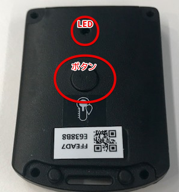
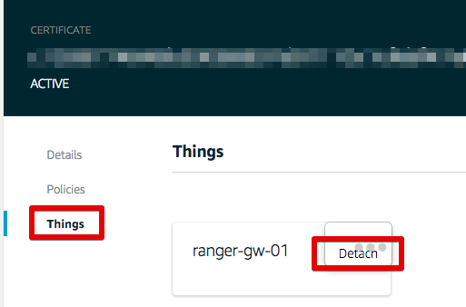
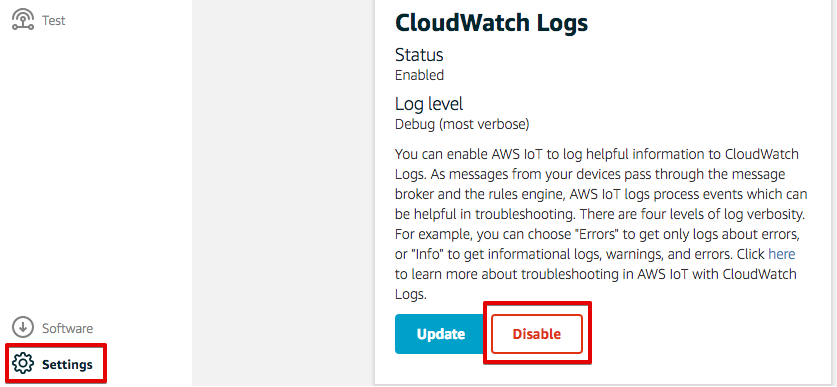
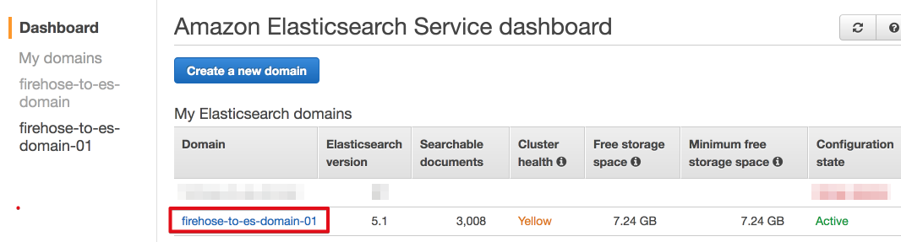
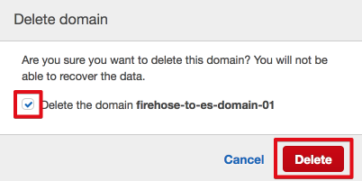
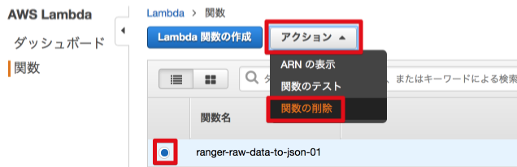
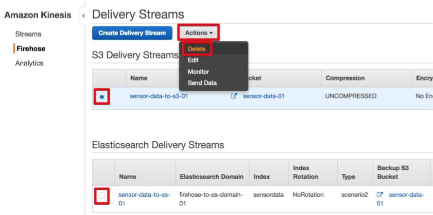
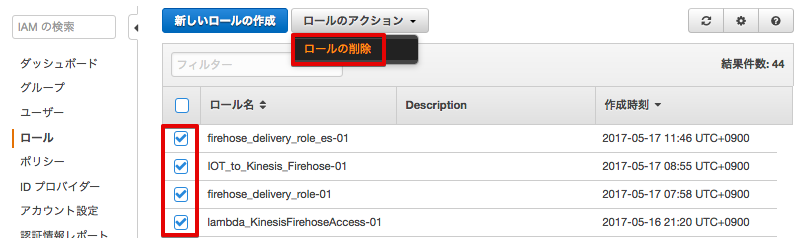
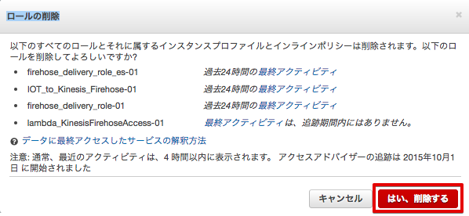

====================================
 ハンズオン終了後の後片付け
====================================

ハードウェアの後片付け
============================

ゲートウェイを初期化する
-------------------------------

ゲートウェイの電源が入った状態で、本体裏面にあるリセット用ボタンを5秒以上長押しして、工場出荷状態に戻して下さい。

.. image:: images/03/reset.png

|

ゲートウェイの電源を切る
-------------------------------

ゲートウェイからUSBケーブルを抜いて電源を切って下さい。

センサーの電源を切る
-------------------------------

温湿度センサーのスライドスイッチをスライドさせて電源を切って下さい。

.. image:: images/03/sensor-power-on-off.png

|

センサーは、電池で動作していますので、必ず電源をOFFにして下さい。
電源が入っていれば、温湿度センサーのボタンを押すとLEDが緑色に点灯しますので確認できます。

|

AWSの設定の後片付け
=================================

ハンズオン終了後のAWSの課金発生を無くすために、今回のハンズオンで作成したAWSのリソースを削除します。BLEゲートウェイの電源を切れば、AWS IoTでの課金は発生しなくなりますので、後日、削除して頂いても大丈夫です。S3とオプションシナリオのElastic Search Serviceだは、入力データが無くても課金対象になりますので、必ず削除して下さい。

AWS IoTのリソースを削除
------------------------------------

AWS IoTの証明書、ポリシー、デバイスを削除するためには、削除前にアタッチされているリソースをデタッチする必要があります。（ルールは他のリソースとの関連性はありません）

- マネージメントコンソールのサービスから[AWS IoT]を選択します。
- メニューから、[Security]-[Certificate]をクリックします。
- 削除したい証明書を選択します。
- メニューから、[Things]を選び、[Detach] して下さい。
- Policyも同様に[Detach] して下さい。

|

- 削除したいリソース(Certificate, Thing, Policy)を選択し、"Actions"のメニューから"Delete”を選択します。

.. image:: images/09/delete.png

|

Ruleも同様に削除します。

.. image:: images/09/rule-delete.png

|

ワーニングが出ますが、[Yes, continue with delete]をクリックして削除して下さい。

.. image:: images/09/detelte-rule-warning.png

|

AWS IoTのCloudWatchログを有効にしている場合、無効にします。
Settingsをクリックし、CloudWatch Logsの[Disable]をクリックして無効にして下さい。

|

S3バケットを削除
------------------------

マネージメントコンソールのサービス一覧から[S3]をクリックして開きます。
リストからバケット”sensor-data-<参加者番号>”のアイコンをクリックして選択します。[バケットを削除する]をクリックして下さい。

.. image:: images/09/s3-delete.png

|

確認画面が表示されますので、"バケットの名前を入力する"にバケット名を入力して、[確認]をクリックして下さい。

.. image:: images/09/s3-delete-confirm.png

|

ElsticSearch Serviceの設定を削除
------------------------------------------------

マネージメントコンソールのサービス一覧から[ElsticSearch Service]をクリックして開きます。
Domain”firehose-to-es-domain-<参加者番号>”をクリックします。

|

画面の下までスクロールし、"Delete Elasticsearch domain"をクリックすると、[Delete domain] ボタンが表示されるので、クリックします。

.. image:: images/09/elasticsearch-delete-2.png

|

確認画面が表示されますので、"Delete the domain ...."のチェックを入れ、[Delete] ボタンをクリックします。

|

Lambda関数を削除
------------------------

マネージメントコンソールのサービス一覧から[Lambda]をクリックして開きます。Lammbda関数 ranger-raw-data-to-json-<参加者番号>をチェックし、[アクション]から、"関数の削除"を選びます。確認画面が表示されるので[削除]をクリックします。
同様に、Lammbda関数 rsensor-raw-data-to-json-mqtt-publish-<参加者番号>も削除して下さい。

|

Kinesis Firehoseの設定を削除
------------------------------------------------

マネージメントコンソールのサービス一覧から[Kinesis]をクリックして開きます。[Firehose コンソールに移動]をクリックし、Kinesis Firehoseの設定画面に移動します。

S3 Delivery Streamsから、"sensor-data-to-s3-<参加者番号>" をチェックし、[アクション]から、"Delete"を選びます。確認画面が表示されるので[削除]をクリックします。

|

確認画面が表示されるので、delivery stream 名を入力し、[Delete]をクリックします。ElasticSearch Delivery Streamsも同様の方法で削除します。

.. image:: images/09/firehose-delete-confirm.png

|

IAMロールを削除
------------------------

マネージメントコンソールのサービス一覧から[IAM]をクリックして開きます。
メニューから[ロール]をクリックして下さい。右上の設定アイコンを押して、作成時刻を表示して下さい。
作成事項でソートすると、本ハンズオンで作成したロールが見えます。

.. image:: images/09/IAM-roles.png

|

本ハンズオンで作成した下記のロールのみにチェックを入れ、[ロールの削除]をクリックして下さい。

* IOT_to_Kinesis_Firehose-<参加者番号>
* firehose_delivery_role-<参加者番号>
* lambda_KinesisFirehoseAccess-<参加者番号>
* lambda_awsiot_mqtt_publish-<参加者番号>
* firehose_delivery_role_es-<参加者番号>　(これは、オプションです。)

|

確認画面が表示されますので、[はい、削除する]をクリックして下さい。

|
