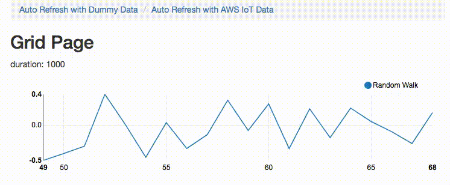

==================================
 AWS IoT ハンズオン Dojo ~基本編~
==================================

.. toctree::
   :hidden:
   :maxdepth: 2
   :numbered:

   01
   02
   03
   04
   05
   06
   07
   08
   09
   10

本書はAWS IoTおよびAWSの各サービスを利用してIoTの基本的なシステムを構築するためのハンズオン手順 について記述しております。

前提条件
=============

1. レンジャーシステムズ製 ゲートウェイ、BLEセンサー、USBケーブル

2. Wi-Fiでインターネットに接続できる環境

   * 企業内のWiFiは、証明書を使って接続するものが多いですが、ハンズオンキットはこれに対応していません。
   * Guest WiFiの様なパスワード(WPA-PSK方式)で接続可能なWiFi環境が必要です。

3. AWSアカウント

   * 基本的に参加者お一人様につき、個別のAWSアカウント持って頂くことが前提です。
   * 一つのアカウントでの実施も可能です。その場合。事前にIAMユーザーを作って頂くことになります。
   * IAMユーザーの作成方法は、事前準備の項を参照して下さい。

4. PC、もしくは Mac

   * Windows PCもしくは、Macを使用します。参加者お一人に1台のマシンをご用意して頂きます。
   * 各種設定を行うためにWebブラウザを使用します。インターネットエクスプローラーとFireFoxでは問題が出る場合が有りますので、Webブラウザは、必ず、Google Chromeをお使い下さい。

5. ACコンセント

   * 参加者お一人につき、ハンズオンキットとPC用にAC電源が、2口必要です。

6. 対象者として以下の方を想定

   * IoTを活用したアプリケーション構築をご検討されているデベロッパーの方
   * AWSクラウドを活用したシステム・アプリケーション開発に従事されている方

注意事項
=============
* 複数の参加者で1つのAWSアカウントを共用する場合は「参加者番号」を 01 〜 99 で定めて、各自で重複しないようにして下さい。一人で1つのAWSアカウントを利用する場合は「参加者番号」は 01 としてください。
* AWSアカウントは作成後1年間ご利用頂ける無料枠があります。本ハンズオンはその通り実施頂き、ハンズオン終了後に削除することで無料利用枠の範囲で収まるようになっております。無料枠を越えたAWSサービスのご利用料金は受講者の方にご負担いただきますよう、ご了承ください。
* 本番利用されているAWSアカウントでハンズオンを実施するのは避けて下さい。
* ハンズオンに必要な機材は貸出品となりますので、終了後は必ず返却をお願いします。

事前準備
============================

Webブラウザの確認
-------------------------

ハンズオンで使用するPC上のGoogle Chromeで下記のページをアクセスし、

http://awsiot-linechart.s3-website-ap-northeast-1.amazonaws.com

下記の様にグラフが表示されることをご確認下さい。グラフがアニメーションのように動けば大丈夫です。

|

IAMユーザーの作成
--------------------------------

複数の参加者で1つのAWSアカウントを共用する場合は、他の参加者のためにIAMユーザーを作成して頂く必要があります。ルートアカウントを使用する場合でも、ハンズオン内でグラフ表示を行うときにアクセスキーID、シークレットアクセスキーを使用しますので、IAMユーザーを作成して下さい。

* AWS マネジメントコンソールのIAMから、「ユーザー」をクリックします。
* 「ユーザーの追加」ボタンをクリックします。
* ユーザー名を付けます。
* 「自動生成パスワード」、「AWS マネジメントコンソールへのアクセス」を有効にして、「次のステップ：アクセス権限」をクリックします。
* 「既存のポリシーを直接アタッチ」をクリックします。
* 「AdministratorAccess」を選択し、「次のステップ：確認」をクリックします。
* 「ユーザーの作成」をクリックします。
* 「csvのダウンロード」をクリックし、閉じます。

ルートユーザーの方は、IAMユーザー参加者に、ハンズオン開催前に、下記の連絡をお願い致します。これらは、ダウンロードしたcsvファイルに記載されています。

* AWSマネジメントコンソールにログインするURL
* AWSのアカウントID (12桁の数字)
* IAMユーザー名
* IAMユーザー パスワード
* アクセスキーID
* シークレットアクセスキー

※ アクセスキー ID、シークレットアクセスキーは、後にグラフ表示のところで使用します。その際、保存したcsvファイルを参照して下さい。

参考：AWS アカウント内での IAM ユーザーの作成方法

http://docs.aws.amazon.com/ja_jp/IAM/latest/UserGuide/id_users_create.html

参考情報
============

* `レンジャーシステムズ株式会社：IoTコネクティングサービス <http://www.ranger-systems.co.jp/iot/>`_
